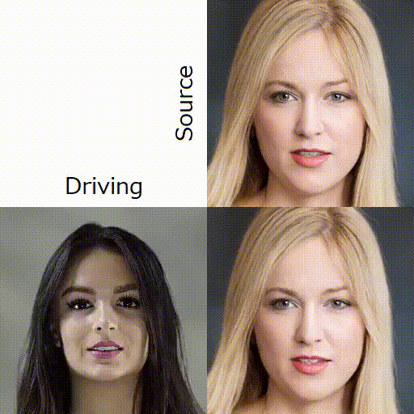

# First Order Motion Model for Image Animation

This is a NNabla implementation of [First Order Motion Model for Image Animation](https://github.com/AliaksandrSiarohin/first-order-model).

<p align="center">

</p>
<p align="center">
Figure: Sample of generated animation by First Order Motion Model. Given a single source image and a driving video, this model can <i>animate</i> the input source image.
</p>


## Quickstart (inference with pretrained weights)

Simply run this. (It will automatically download the pretrained weights and a config file.)

```
python animate.py --source imgs/sample_src.png \
                  --driving imgs/sample_drv.mp4 \
                  --adapt-movement-scale --fps 24
```

You will get the same result above. You can use other images/videos for source/driving data.
For more details, please go to [Animation section](#animation).

# Preparation

## Prerequisite

You need packages below.

```
nnabla >= 1.16.0
matplotlib
imageio-ffmpeg
scikit-image
```

## Dataset

### VoxCeleb

To obtain VoxCeleb dataset, follow the instruction [here](https://github.com/AliaksandrSiarohin/video-preprocessing).

### Other Dataset

Though we didn't conduct performance evaluation and comparison, you can use other dataset for training as well. Note that you need to create config file for each dataset. You may also need to modify some of the scripts.


## Training

Before training, you need to put the training data in `./data`. For example, if you want to use VoxCeleb dataset for training (and evaluation), `data` directory should contain `train` and `test` subdirectories. Also, you need pretrained weights of VGG19 to use perceptual loss. You can download it from [here](https://nnabla.org/pretrained-models/nnabla-examples/GANs/first-order-model/vgg19.h5).

```
python train.py --config <path to config file>
```

You can change configuration by modifying the config file such as `config/vox-256.yaml`

If you have multiple GPUs it is highly recommended to use distributed training.

```
mpirun -n <number of GPUs> python train.py --config <path to config file>
```

You can find training logs and intermediate results in a log directory, which is generated in `tmp.monitor/<training_date>` (by default).

After training finishes, in the same directory you should find the parameter files (stored as `.h5`) and config file (`training_info.yaml`) as well as log files. These can be used for image animation. 

[According to the the author](https://github.com/AliaksandrSiarohin/first-order-model/issues/127#issuecomment-620971294), training with VoxCeleb should be done in 2 stages, first without Discriminator and then with Discriminator. You can do that like;

```
python train.py --config config/vox-256.yaml
python train.py --config config/vox-adv-256.yaml \
                --ft-params <path to params_at_epoch_XX.h5 generated by the training above>
```

## Reconstruction

In motion transfer task, one of the major evaluation metrics is reconstruction error rate.
If we use the source image which is originally the first frame of the driving videos, generated fake videos should be the same as the driving video (ideally). Reconstruction error rate is difined as the average of L1 distance between each frame pairs of generated and driving videos.

To evaluate, simply run;

```
python reconstruct.py --config <path to the training_info.yaml created during training> \
                      --params <path to the parameters>  # optional
```

It will generate a new directory (named `result/<training_date>` by default) (you can choose the directory by using`--out-dir` option), and inside it you can find `reconstruction` directory. All the generated result will be stored there. Also, after all the reconstruction is completed, averaged L1 distance is shown.

You can use the following options;

* `--output-png`: generate image files (as `.png`) instead of video (`.mp4`).
* `--fps`: framerate of generated videos (10 by default). Has no effect when `--output-png` is specified.
* `--only-generated`: visualize and save fake images only.
* `--detailed`: visualize and save source image with keypoints, driving image with keypoints, deformed source image, generated image with (normalized) keypoints, generated image and occlusion map per frame.
* `--full`: along with the images described above, save and visualize each of the warped source images by local affine transformations and its corresponding masks.
* `--eval`: output additional `.png` files in `result/<training_date>/reconstruction/png` directory, which can be used for evaluation (AKD and AED).

### Evaluation

**Currently we verified the performance on VoxCeleb dataset only.**

We tested the model's performance by L1 distances (L1), Average Keypoints Distance (AKD) and Average Euclidean Distance (AED) as reported in the paper. Results are shown below.

| - | PyTorch (Paper) | NNabla |
| :---: | :---: | :---: |
| L1 | 0.044 (0.043) | 0.042 |
| AKD | 1.318 (1.294) | 1.312 |
| AED | 0.141 (0.140) | 0.142 |

Note that we trained the author's model from scratch and used that for evaluation with the same metrics provided [here](https://github.com/AliaksandrSiarohin/pose-evaluation). To conduct the evaluation on your own, please follow the instruction.
The results are slightly worse than those reported in the paper, but that is probably due to the different data (frames) used during the training (frames are randomly chosen). Also, we emphasize that some of the videos in VoxCeleb are removed from YouTube thus they are unavailable.

## Animation

```
python animate.py --config <path to the training_info.yaml created during training> \
                  --source <source image> \
                  --driving <path to a directory containing driving video frames> \
                  --params <path to the parameters>  # optional
```

You need to specify these;
* `--config`: path to the configuration file (such as `training_info.yaml`). It is required to use the same configuration as training. It also contains some configuration for animation.
* `--source`: source image (such as `.png`). in other words, the face image you want to animate. It'd be better if its size is 256x256. If not it will be resized and lead to poor result.
* `--driving`: motion reference. video (such `.mp4`) or sequential images extracted from a video. Same as the source image, its size should be 256x256. It will be resized as well.

Optionally you can use these;
* `--params`: pretrained weights to use for inference. If not specified, the weights recorded in the `--config` file is used.

As described in the original repository, there are 2 ways to perform animation. One with absolute coordinates (of the keypoint locations) and another with relative coordinates. In short, using relative coordinates performs better, but in this case, the object in the first frame of the video and in the source image need to have the same pose (viewpoint, angle, and expression). Using absolute coordinates requires no pose constraint, but usually performs worse. It is recommended to use relative coordinates with carefully chosen source image and driving video.

* `--adapt-movement-scale`: adjusts the movement scale of the object in source and driving images. In effect only when using relative coordinates.
* `--unuse-relative-movement`: NOT use relative displacement of keypoints (perform animation with absolute coordinates).
* `--unuse-relative-jacobian`: NOT use relative change in jacobian (perform animation with absolute coordinates).

Note that `animate.py` **uses relative coordinates (without movement adaptation) by default**. If you want to change it, use flags above.

You will get the animation result in `result/<training_date>/arbitrary` directory (by default).
You can use the same options described in [Reconstruction section](#reconstruction). 


## Pretrained Weights

You can download the pretrained weights from [here](https://nnabla.org/pretrained-models/nnabla-examples/GANs/first-order-model/pretrained_fomm_params.h5) corresponding config file can be downloaded from [here](https://nnabla.org/pretrained-models/nnabla-examples/GANs/first-order-model/voxceleb_trained_info.yaml).

## License

All the codes except ones in `external_utils.py` are provided under Apache-2.0 License.
`external_utils.py` contains the code used in the original repository which is published under CC BY-NC 4.0.


## Reference

* Paper: [First Order Motion Model for Image Animation](http://papers.nips.cc/paper/8935-first-order-motion-model-for-image-animation.pdf).
* code: https://github.com/AliaksandrSiarohin/first-order-model
