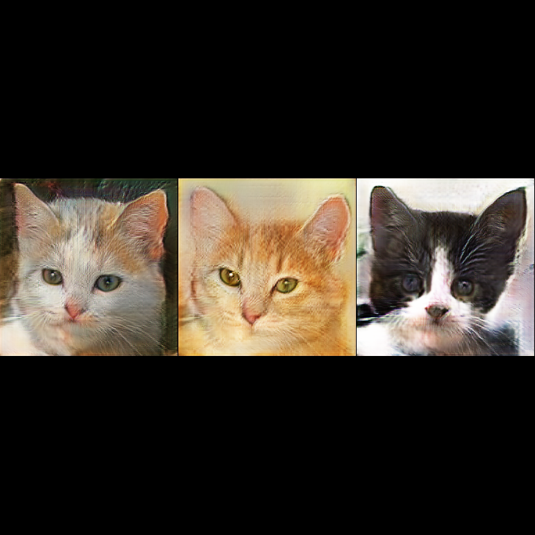

# Towards Faster and Stabilized GAN Training for High-fidelity Few-shot Image Synthesis

---

## Overview

This is an NNabla implementation of ["Towards Faster and Stabilized GAN Training for High-fidelity Few-shot Image Synthesis."](https://openreview.net/forum?id=1Fqg133qRaI)

These are result examples:



---

## Start training

Prepare a training dataset. Several datasets for few-shot learning of GANs are available [here](https://hanlab.mit.edu/projects/data-efficient-gans/datasets/).

Once the dataset is ready, you can start training by

```
python train.py --img-path *path-to-dataset*
```

---

## License

See `LICENSE`.
