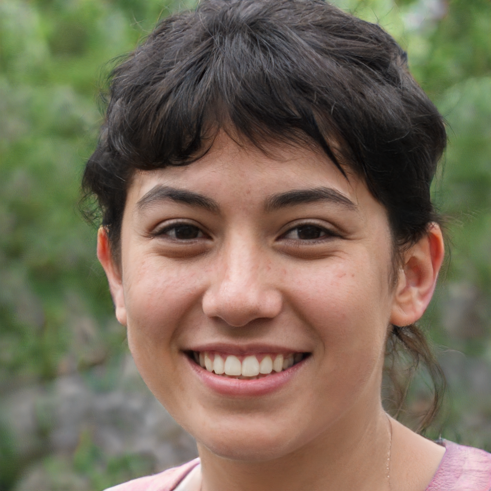
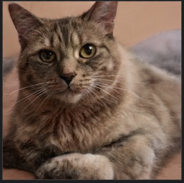
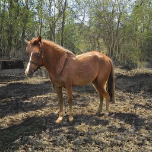

# StyleGAN2

<p align="center">

</p>
<p align="center">
Figure: Generated image samples. (resized to 256x256)
</p>

This is a NNabla implementation of [StyleGAN2](https://github.com/NVlabs/stylegan2).
Currently, only inference (for 6 generation types of datasets) is supported.

# Preparation

## Prerequisites

* nnabla
* python >= 3.6

## Pretrained Weight

We converted the pretrained weight of different works (which can be found [here](https://github.com/justinpinkney/awesome-pretrained-stylegan2)) to the format compatible that is compatible with Nnabla. 

Running `generate.py` will automatically download the converted weight, but you can manually download the weights of different datasets from the following links:

| Object | Human Face | Car | Cat |
| :---: | :---: | :---: | :---: |
| Resolution | 1024x1024 | 512x512 | 256x256 |
| Sample | <a href="url"></a> | <a href="url"></a> | <a href="url"></a> | 
| Pretrained Weights | [download](https://nnabla.org/pretrained-models/nnabla-examples/GANs/stylegan2/styleGAN2_G_params.h5) | [download](https://nnabla.org/pretrained-models/nnabla-examples/GANs/stylegan2/car.h5) | [download](https://nnabla.org/pretrained-models/nnabla-examples/GANs/stylegan2/cat.h5) |

| Object | Horse | Church | ImageNet |
| :---: | :---: | :---: | :---: |
| Resolution | 256x256 | 256x256 | 512x512 |
| Sample | <a href="url"></a> | <a href="url"></a> | <a href="url"></a> |
| Pretrained Weights | [download](https://nnabla.org/pretrained-models/nnabla-examples/GANs/stylegan2/horse.h5) |[download](https://nnabla.org/pretrained-models/nnabla-examples/GANs/stylegan2/church.h5) | [download](https://nnabla.org/pretrained-models/nnabla-examples/GANs/stylegan2/imagenet.h5) |

## Generation

You can generate non-existent person's face by;

```
python generate.py --seed 217 --batch-size 4 --dataset-type human_faces
```

With `--seed` option, you need to specify the random seed used to obtain latent code (**z** in the paper). With `--batch-size` option, you can specify the number of images to generate.

With `--dataset-type` option, you can specify the type of object to be generated. Currently 6 choices are supported for this option which are as follows: 

```
human_faces, car, cat, horse, church, imagenet
```

`human_faces` is the default option. 

As written in the paper, truncation trick is used by default. You can change the value for that by `--truncation-psi`. Also, seed used for noise input to the synthesis network (input to **B** block in the paper) can be specified by `--stochastic-seed`. For example;

```
python generate.py --seed 217  --truncation-psi 0.7  --stochastic-seed 1993
```

## Generation with style mixing

<p align="center">

</p>
<p align="center">
Figure: Sample of generated images with style mixing.
</p>

If you want to generate images with style mixing, run the command below;

```
python generate.py --seed 217  --mixing --seed-mix 6600
```

By default, the seed specified by `--seed` is used for coarse styles (injected in lower resolution, namely 4x4 - 32x32) and another seed specified by `--seed-mix` is used for fine styles (injected in higher resolution, namely 64x64 - 1024x1024). You can change this by specifying the last layer to use the coarse style with `--mix-after`.


# Citation

This is based on [Analyzing and Improving the Image Quality of StyleGAN](http://arxiv.org/abs/1912.04958).
```
@article{Karras2019stylegan2,
  title   = {Analyzing and Improving the Image Quality of {StyleGAN}},
  author  = {Tero Karras and Samuli Laine and Miika Aittala and Janne Hellsten and Jaakko Lehtinen and Timo Aila},
  journal = {CoRR},
  volume  = {abs/1912.04958},
  year    = {2019},
}
```
