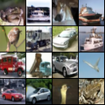
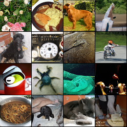
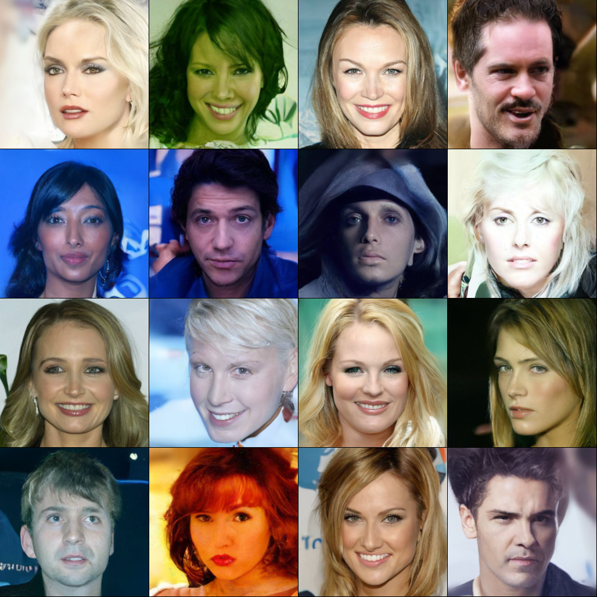

# Denoising Diffusion Probabilistic Models

This is a reproduction of [Improved Denoising Diffusion Probabilistic Models](http://proceedings.mlr.press/v139/nichol21a/nichol21a.pdf) implemented by nnabla.
The code structure is inspired by the [original author's implementation](https://github.com/openai/improved-diffusion).

<p align="center">


</p>
<p align="center">

</p>
Figure: Generated image samples by models trained on cifar10 (32x32), imagenet_64x64, and CelebA-HQ(256x256). Note that all samples are resized for visualization.
</p>

## Quick demo on Colab
TODO

## Instalation
To install dependencies, run as below:
```
# install dependencies
pip install -r requirements.txt

# install NEU
cd /path/to/nnabla-examples/utils
pip install -e .
```

## Generating images by pre-trained models
To generate images by pre-trained weights, you should download a yaml file for model config and a h5 file.
Please munualy download them from the following list.

| Dataset | Resolution | download link | FID |
| :---: | :---: | :---: | :---: |
| Cifar10 | 32 x 32 | [config](https://nnabla.org/pretrained-models/nnabla-examples/diffusion-models/config_cifar10.yaml) / [weight](https://nnabla.org/pretrained-models/nnabla-examples/diffusion-models/params_cifar10.h5)| 3.49 |
| Imagenet | 64 x 64 | [config](https://nnabla.org/pretrained-models/nnabla-examples/diffusion-models/config_imagenet64.yaml) / [weight](https://nnabla.org/pretrained-models/nnabla-examples/diffusion-models/params_imagenet64.h5) | 21.79 |
| CelebA-HQ | 256 x 256 | [config](https://nnabla.org/pretrained-models/nnabla-examples/diffusion-models/config_celebahq.yaml) / [weight](https://nnabla.org/pretrained-models/nnabla-examples/diffusion-models/params_celebahq.h5) | todo |

Note that the FID scores shown on the list are computed by 50K generated images against training data for all datasets except 10K generated images for imagenet.

After downloading them, you can generate images as follows:
```bash
python generate.py --config <your config file path> --param <your h5 file path>
```
You can see generated results in `./outs` directory as default.
Running inference with above pretrained models on a single nvidia A100 GPU takes about 1 min for cifar10, 3 min for Imagenet 64x64, and 30 min for CelebA-HQ, respectively. 
You can also specify the sampling interval for generation by `--sampling-interval (or -s) x`. In this case, only T / x sampling steps are performed and inference time will be x times faster.

We also support DDIM samplers that enabls deterministic sampling. If you would like to use it, try `--ddim` option.
For more details about DDIM, please see the [original paper](http://proceedings.mlr.press/v139/nichol21a/nichol21a.pdf).

## Download data for training

### cifar-10
The data iterator for Cifar-10 dataset will automatically download the dataset.
All you have to do is specifying `cifar10` as dataset name like `python train.py --dataset cifar10`.

### imagenet
To download the original ILSVRC2012 dataset, please follow [the instruction for the imagenet classification examples](https://github.com/sony/nnabla-examples/tree/master/imagenet-classification#preparing-imagenet-dataset).
After downloading it, you will have `<your data dir>/ilsvrc2012/train` and `<your data dir>/ilsvrc2012/val`.
You can train your model on imagenet with 256x256 resolution by specifying your dataset path as `python train.py --dataset imagenet_256 --data_dir <your data dir>`.
(You should specify the parent directory having `train` as sub-directory.)

### imagenet-64
For a resolution lower than 64x64, we use the imagenet dataset already downsampled.
You can download 64x64 version of ILSVRC from the same imagenet download link (registration is required).

After downloading it, we assume the dataset is saved as `<your data dir>/train_64x64` and `<your data dir>/val_64x64`.
Then you can train your model on low-resolution imagenet by `python train.py --dataset imagenet64 --data_dir <your data dir>`.
(You should specify the parent directory having `train_64x64` as sub-directory.)

### CelebA-HQ
To download CelebA-HQ dataset, please follow [the official github](https://github.com/tkarras/progressive_growing_of_gans#preparing-datasets-for-training).

After creating dataset, you will have the directory named `<your data dir>/celeba-hq-{resolution}/images` which has all images as jpg format.
Note that you should use the same resolution as or larger resolution than the one you would like to train (e.g. if you train your model with 256x256, you should use 256x256 or larger).

Then, you can train your model on CelebA-HQ by `python train.py --dataset celebahq --data_dir <your data dir>/celeba-hq-{resolution}`.
(You should specify the parent directory having `images` as sub-directory.)

## Training
We prepare the training scripts for cifar-10, imagenet, and CelebA-HQ dataset, respectively.
See `scripts/` directory for more detail.

Note that all scripts assume multi-GPU training with 4 GPU.
If you would like to train your model with a single GPU, please remove `mpirun -N 4` from each script.

As for the dataset path, `./data` is used as `--data_dir` as default.
In other words, we assume `./data` is a symbolic link for the path we describe in `Download data for training` section above.
If you have some errors related to dataset, please check your dataset path is correct.

