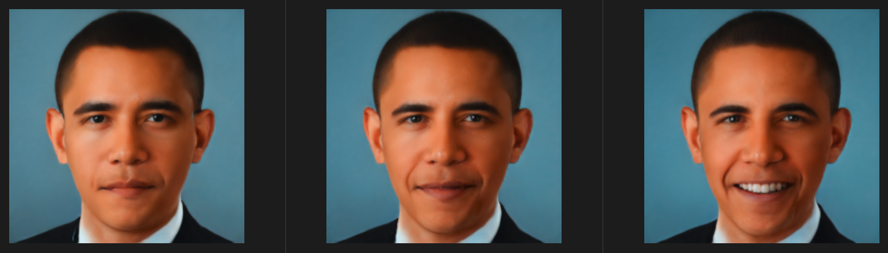

# Image2StyleGAN: How to Embed Images Into the StyleGAN Latent Space?
---

## Overview

This is an NNabla implementation of ["Image2StyleGAN: How to Embed Images Into the StyleGAN Latent Space?"](https://arxiv.org/abs/1904.03189)
The implementation is using StyleGAN2 as model and our pretrained VGG16 or MobileNetV1 in NNabla.
(We added the MobileNetV1 option in order to run faster though it was not used in the paper.)



### Embedding

1. This image embedding needs latent code optimizing for the pre-trained model and the input image.
Therefore, you must optimize as below:
```
python main.py \
  --config_path [PATH to config same as ../stylegan2-training/configs/*.yaml] \
  --gen_path [PATH to pre-trained generator model] \
  --img_path [PATH to image]
```
2. Run the inference as below:
```
python inference.py \
  --config_path [PATH to config same as ../stylegan2-training/configs/*.yaml] \
  --gen_path [PATH to pre-trained generator model] \
  --latent_path [PATH to latent code]
```

## References
- [StyleGAN2 paper](http://arxiv.org/abs/1912.04958)
- [Image2StyleGAN paper](https://arxiv.org/abs/1904.03189)
