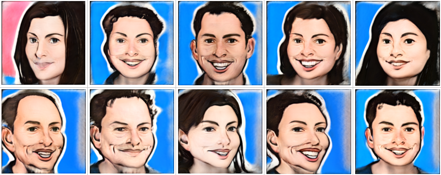

# Few-shot Image Generation via Cross-domain Correspondence
---

## Overview

This is an NNabla implementation of ["Few-shot Image Generation via Cross-domain Correspondence"](https://arxiv.org/abs/2104.06820)
The implementation is using StyleGAN2 as model and training in NNabla.
These are result examples:



### Training

Run the training as bellow:

```
python main.py --dataset [PATH to dataset] --pre_trained_model [PATH to pretrained weights] --train
``` 

### Inference

Inference operations of image generation, latent space interpolation in W space, style mixing, latent space projection and perceptual path length calculation is supported. 
For inferece, run as follows:

```
python main.py --img_size [256/512/1024] --test [generate/latent_space_interpolation/style_mixing/latent_space_projection/ppl] --weights_path [PATH to pretrained weights] --results_dir [path to store generated results]
```

To infer with the weights from the original StyleGAN-2 repository, run as follows:

```
python main.py --img_size [256/512/1024] --test [generate/latent_space_interpolation/style_mixing/latent_space_projection/ppl] --use_tf_weights --results_dir [path to store generated results] 
```

Following set of additional arguments from command line are supported:

- For `generate`: 
  - `--batch_size [BATCH-SIZE]`: in this case, number of images to generate

- For `latent_space_interpolation`: 
  - `--batch_size [BATCH-SIZE]`: in this case, number of images to generate
  - `--seed_1`: Seed for random sampling of first latent vector in Z space
  - `--seed_2`: Seed for random sampling of second latent vector in Z space

- For `style_mixing`: 
  - `--batch_size_A [BATCH-SIZE]`: Batch-size for style A: coarse style
  - `--batch_size_B [BATCH-SIZE]`: Batch-size for style B: fine style

- For `latent_space_projection`: 
  - `--img_path [PATH]`: Path to the image to be projected into the latent space

- For `ppl`: 
  - `--batch_size [BATCH-SIZE]`: in this case, number of images to generate in one forward pass of the evaluation (Note that FID and IS are not supported for now)

## References
- [StyleGAN2 paper](http://arxiv.org/abs/1912.04958)
- [CDC paper](https://arxiv.org/abs/2104.06820)
- [code](https://github.com/utkarshojha/few-shot-gan-adaptation)
