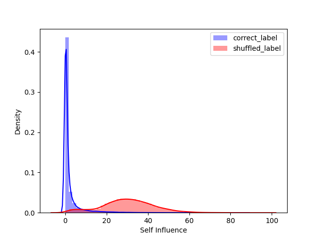
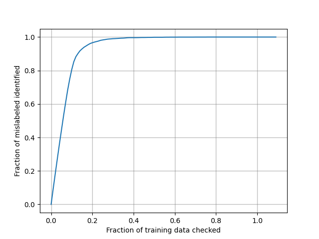

# Responsible AI

## Overview

These are examples of responsible AI that consists of eXplainable AI and fairness of machine learning. 

In order to utilize AI technology to enrich human's life style and contribute to the development of society, we will pursue fairness,  transparency, and accountability while actively engaging in dialogue with stakeholders. We will continue to contribute responsible AI in order to maintain the trustworthy of our products and services.

---

## Data cleansing with with Storage-efficient Approximation of Influence Functions [code](./data_cleansing/)

> **Data Cleansing for Deep Neural Networks with Storage-efficient Approximation of Influence Functions**
> Kenji Suzuki, Yoshiyuki Kobayashi, Takuya Narihira.
> *arXiv technical report ([arXiv 2103.11807]( https://arxiv.org/abs/2103.11807))*            

## Grad-CAM [code](./gradcam/)
> **Grad-CAM: Visual Explanations from Deep Networks via Gradient-based Localization**
> Ramprasaath R. Selvaraju, Michael Cogswell, Abhishek Das, Ramakrishna Vedantam, Devi Parikh, Dhruv Batra.
> *arXiv technical report ([arXiv 1610.02391](https://arxiv.org/abs/1610.02391))* 

## TracIn [code](./tracin/)
> **Estimating Training Data Influence by Tracing Gradient Descent**
> Garima Pruthi, Frederick Liu, Mukund Sundararajan, Satyen Kale.
> *arXiv technical report ([arXiv 2002.08484](https://arxiv.org/abs/2002.08484))* 

## Facial evaluation for skin color [code](./face_evaluation/)
This is a colab interactive demo of facial evaluation for skin colors by using Individual Typology Angle (ITA), which represents skin color.
> **Diversity in Faces**
> Michele Merler, Nalini Ratha, Rogerio S. Feris, John R. Smith.
> *arXiv technical report ([arxiv 1901.10436](https://arxiv.org/abs/1901.10436))* 

