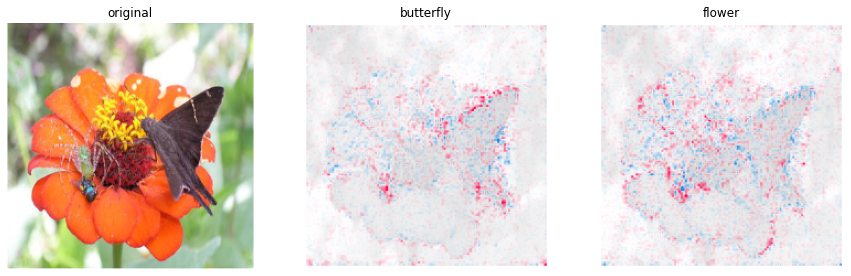
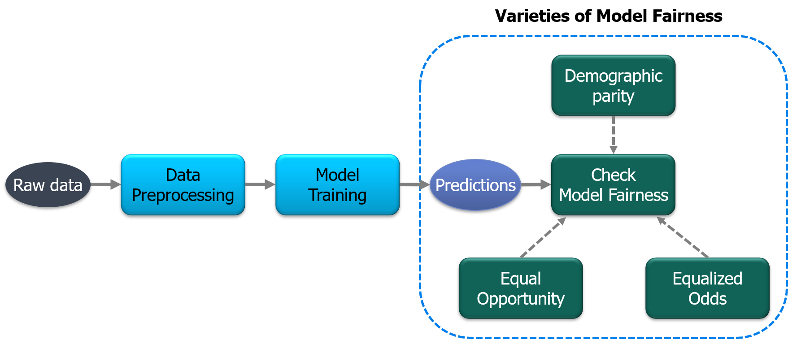
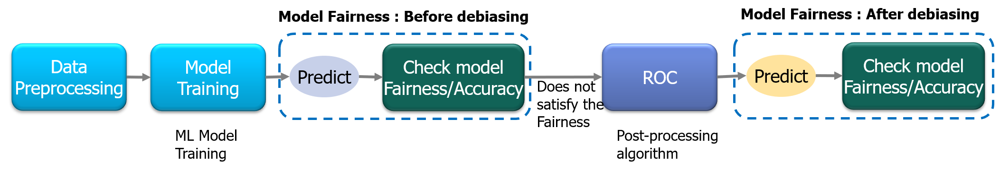

# Responsible AI

## Overview

These are examples of responsible AI that consists of eXplainable AI and fairness of machine learning. 

In order to utilize AI technology to enrich human's life style and contribute to the development of society, we will pursue fairness,  transparency, and accountability while actively engaging in dialogue with stakeholders. We will continue to contribute responsible AI in order to maintain the trustworthy of our products and services.

---

# 1. Visualization
## Grad-CAM [code](./gradcam/)
> **Grad-CAM: Visual Explanations from Deep Networks via Gradient-based Localization**
> Ramprasaath R. Selvaraju, Michael Cogswell, Abhishek Das, Ramakrishna Vedantam, Devi Parikh, Dhruv Batra.
> *arXiv technical report ([arXiv 1610.02391](https://arxiv.org/abs/1610.02391))* 

  

## SHAP (image data) [code](./shap/)
> **A Unified Approach to Interpreting Model Predictions**
> Scott Lundberg, Su-In Lee.
> *arXiv technical report ([arXiv 1705.07874](https://arxiv.org/abs/1705.07874))* 

  

## Kernel SHAP (tabular data) [code](./kernel_shap/)
> **A Unified Approach to Interpreting Model Predictions**
> Scott Lundberg, Su-In Lee.
> *arXiv technical report ([arXiv 1705.07874](https://arxiv.org/abs/1705.07874))* 

  

 

# 2. Influence
## Data cleansing with with Storage-efficient Approximation of Influence Functions [code](./data_cleansing/)

> **Data Cleansing for Deep Neural Networks with Storage-efficient Approximation of Influence Functions**
> Kenji Suzuki, Yoshiyuki Kobayashi, Takuya Narihira.
> *arXiv technical report ([arXiv 2103.11807]( https://arxiv.org/abs/2103.11807))*            

## Understanding Black-box Predictions via Influence Functions [code](./data_cleansing/)

> **Understanding Black-box Predictions via Influence Functions**
> Pang Wei Koh, Percy Liang.
> *arXiv technical report ([arXiv 1703.04730]( https://arxiv.org/abs/1703.04730))*            

## TracIn [code](./tracin/)
> **Estimating Training Data Influence by Tracing Gradient Descent**
> Garima Pruthi, Frederick Liu, Mukund Sundararajan, Satyen Kale.
> *arXiv technical report ([arXiv 2002.08484](https://arxiv.org/abs/2002.08484))* 

## Representer Point [code](./representer_point/)
> **Representer Point Selection for Explaining Deep Neural Networks**
> Chih-Kuan Yeh, Joon Sik Kim, Ian E.H. Yen, Pradeep Ravikumar.
> *arXiv technical report ([arXiv 1811.09720](https://arxiv.org/abs/1811.09720))* 

 

# 3. Fairness
## Three Metrics [code](./three_metrics/)
> **The Impossibility Theorem of Machine Fairness -- A Causal Perspective**
> Kailash Karthik Saravanakumar.
> *arXiv technical report ([arXiv 2007.06024](https://arxiv.org/abs/2007.06024)*

## Gender Bias Mitigation [code](./gender_bias_mitigation/)
> **Data preprocessing techniques for classification without discrimination**
> Kamiran, Faisal and Calders, Toon. 
> *[Knowledge and Information Systems, 33(1):1–33, 2012](https://link.springer.com/content/pdf/10.1007/s10115-011-0463-8.pdf)* 

## Adversarial Debiasing [code](./adversarial_debiasing/)
> **Mitigating Unwanted Biases with Adversarial Learning**
> Zhang, Brian Hu, Blake Lemoine, and Margaret Mitchell.
> *[Proceedings of the 2018 AAAI/ACM Conference on AI, Ethics, and Society. 2018, pp. 335–340](https://dl.acm.org/doi/pdf/10.1145/3278721.3278779)* 

## Rejection Option-Based Classification [code](./rejection_option_based_classification/)
> **Decision Theory for Discrimination-Aware Classification**
> F. Kamiran, A. Karim and X. Zhang.
> *[IEEE 12th International Conference on Data Mining, 2012, pp. 924-929](https://ieeexplore.ieee.org/document/6413831)* 

## Facial evaluation for skin color [code](./face_evaluation/)
> **Diversity in Faces**
> Michele Merler, Nalini Ratha, Rogerio S. Feris, John R. Smith.
> *arXiv technical report ([arxiv 1901.10436](https://arxiv.org/abs/1901.10436))* 

