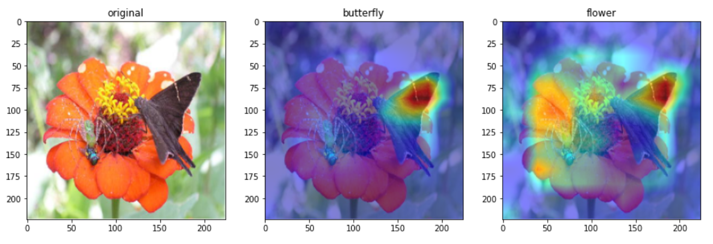

# Responsible AI

## Overview

These are examples of responsible AI that consists of eXplainable AI and fairness of machine learning. 

In order to utilize AI technology to enrich human's life style and contribute to the development of society, we will pursue fairness,  transparency, and accountability while actively engaging in dialogue with stakeholders. We will continue to contribute responsible AI in order to maintain the trustworthy of our products and services.

---

# 1. Visualization
## Grad-CAM [code](./gradcam/)
[Ramprasaath R Selvaraju, Michael Cogswell, Abhishek Das, Ramakrishna Vedantam, Devi Parikh, Dhruv Batra. "Grad-CAM: Visual Explanations from Deep Networks via Gradient-based Localization". Proceedings of the IEEE International Conference on Computer Vision, 2017.](https://openaccess.thecvf.com/content_iccv_2017/html/Selvaraju_Grad-CAM_Visual_Explanations_ICCV_2017_paper.html)

  

## SHAP (image data) [code](./shap/)
[Scott M Lundberg and Su-In Lee. 2017. **A Unified Approach to Interpreting Model Predictions.** In Advances in Neural Information Processing Systems 30. Curran Associates, Inc., 4768–4777.](https://proceedings.neurips.cc/paper/2017/hash/8a20a8621978632d76c43dfd28b67767-Abstract.html)

  

## Kernel SHAP (tabular data) [code](./kernel_shap/)
[Scott M Lundberg, Su-In Lee. "A unified approach to interpreting model predictions". Proceedings of the 31st International Conference on Neural Information Processing Systems, 2017.](https://proceedings.neurips.cc/paper/2017/hash/8a20a8621978632d76c43dfd28b67767-Abstract.html)

  

## Eigen-CAM [code](./eigencam/)
[Muhammad, M. B. & Yeasin, M. "Eigen-CAM: Class Activation Map using Principal Components". in 2020 International Joint Conference on Neural Networks (IJCNN) 1–7 (IEEE, 2020).](https://ieeexplore.ieee.org/document/9206626)

  

 

# 2. Influence
## Data cleansing with with Storage-efficient Approximation of Influence Functions [code](./data_cleansing/)

> **Data Cleansing for Deep Neural Networks with Storage-efficient Approximation of Influence Functions**
> Kenji Suzuki, Yoshiyuki Kobayashi, Takuya Narihira.
> *arXiv technical report ([arXiv 2103.11807]( https://arxiv.org/abs/2103.11807))*            

## Understanding Black-box Predictions via Influence Functions [code](./data_cleansing/)
[Pang Wei Koh, Percy Liang. "Understanding black-box predictions via influence functions". Proceedings of the 34th International Conference on Machine Learning, 2017](http://proceedings.mlr.press/v70/koh17a)

## TracIn [code](./tracin/)
> [Garima Pruthi, Frederick Liu, Satyen Kale, Mukund Sundararajan. **Estimating Training Data Influence by Tracing Gradient Descent**. In Advances in Neural Information Processing Systems, 2020.](https://papers.nips.cc/paper/2020/file/e6385d39ec9394f2f3a354d9d2b88eec-Paper.pdf)

## Representer Point [code](./representer_point/)
> [Chih-Kuan Yeh, Joon Sik Kim, Ian E.H. Yen, Pradeep Ravikumar. **Representer Point Selection for Explaining Deep Neural Networks.** In Advances in Neural Information Processing Systems. pp.9291-9301. 2018](https://proceedings.neurips.cc/paper/2018/file/8a7129b8f3edd95b7d969dfc2c8e9d9d-Paper.pdf)

 

# 3. Fairness
## Evaluation Measure
### Three Metrics [code](./three_metrics/)
> **The Impossibility Theorem of Machine Fairness -- A Causal Perspective**
> Kailash Karthik Saravanakumar.
> *arXiv technical report ([arXiv 2007.06024](https://arxiv.org/abs/2007.06024)*

### Facial evaluation for skin color [code](./face_evaluation/)
> **Diversity in Faces**
> Michele Merler, Nalini Ratha, Rogerio S. Feris, John R. Smith.
> *arXiv technical report ([arxiv 1901.10436](https://arxiv.org/abs/1901.10436))* 

## Pre Processing
### Gender Bias Mitigation [code](./gender_bias_mitigation/)
> **Data preprocessing techniques for classification without discrimination**
> Kamiran, Faisal and Calders, Toon. 
> *[Knowledge and Information Systems, 33(1):1–33, 2012](https://link.springer.com/content/pdf/10.1007/s10115-011-0463-8.pdf)* 

### GAN Data Debiased [code](./gan_data_debiased/)
> **Fair Attribute Classification through Latent Space De-biasing**
> Vikram V. Ramaswamy, Sunnie S. Y. Kim, Olga Russakovsky. 
> *[IEEE/CVF Conference on Computer Vision and Pattern Recognition (CVPR), 2021](https://openaccess.thecvf.com/content/CVPR2021/papers/Ramaswamy_Fair_Attribute_Classification_Through_Latent_Space_De-Biasing_CVPR_2021_paper.pdf)* 

## In Processing
### PRR: Prejudice Remover Regularizer [code](./prejudice_remover_regularizer/)
> **Fairness-aware classifier with prejudice remover regularizer.**
> Toshihiro Kamishima, Shotaro Akaho, Hideki Asoh & Jun Sakuma.
> *[Joint European Conference on Machine Learning and Knowledge Discovery in Databases ECML PKDD 2012: Machine Learning and Knowledge Discovery in Databases pp 35–50](https://doi.org/10.1007/978-3-642-33486-3_3)*

<<<<<<< HEAD
=======
### PRR: Prejudice Remover Regularizer for Images [code](./prejudice_remover_regularizer_images/)
> **Fairness-aware classifier with prejudice remover regularizer.**
> Toshihiro Kamishima, Shotaro Akaho, Hideki Asoh & Jun Sakuma.
> *[Joint European Conference on Machine Learning and Knowledge Discovery in Databases ECML PKDD 2012: Machine Learning and Knowledge Discovery in Databases pp 35–50](https://doi.org/10.1007/978-3-642-33486-3_3)*

>>>>>>> 0f005b62 (update READMEs)
### Adversarial Debiasing [code](./adversarial_debiasing/)
> **Mitigating Unwanted Biases with Adversarial Learning**
> Zhang, Brian Hu, Blake Lemoine, and Margaret Mitchell.
> *[Proceedings of the 2018 AAAI/ACM Conference on AI, Ethics, and Society. 2018, pp. 335–340](https://dl.acm.org/doi/pdf/10.1145/3278721.3278779)* 

### Adversarial Debiasing for Images [code](./adversarial_debiasing_images/)
> **Mitigating Unwanted Biases with Adversarial Learning**
> Zhang, Brian Hu, Blake Lemoine, and Margaret Mitchell.
> *[Proceedings of the 2018 AAAI/ACM Conference on AI, Ethics, and Society. 2018, pp. 335–340](https://dl.acm.org/doi/pdf/10.1145/3278721.3278779)* 

## Post Processing
### Rejection Option-Based Classification [code](./rejection_option_based_classification/)
> **Decision Theory for Discrimination-Aware Classification**
> F. Kamiran, A. Karim and X. Zhang.
> *[IEEE 12th International Conference on Data Mining, 2012, pp. 924-929](https://ieeexplore.ieee.org/document/6413831)* 

