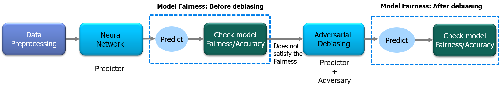

# Adversarial Debiasing
This is a colab interactive demo of Adversarial Debiasing.
Adversarial debiasing procedure takes inspiration from GANs (Goodfellow et al. 2014) for training a fair classifier. In GANs they introduce a system of two neural networks in which the two neural networks compete with each other to become more accurate in their predictions. Likewise, in adversarial debiasing, we build two models:

1. First model is a classifier which predicts target variable based on input features (training data).
2. Second model is an adversary and it tries to predict, the sensitive attribute based on the predictions of the classifier model.

The Classifier and Adversarial networks are trained turn by turn with the objective of minimizing the loss of both the networks.

Figure: Overview of Adversarial Debiasing.

# Interactive demo

|Name| Notebook           | Task  | Example                       |
|:---------------------------------:|:-------------:|:-----:|:------------:|
 [Adversarial Debiasingn](https://arxiv.org/abs/1801.07593) |  | Mitigate the model bias with Adversarial networks ||
 
# Citation
This is based on [Mitigating Unwanted Biases with Adversarial Learning](https://arxiv.org/abs/1801.07593)