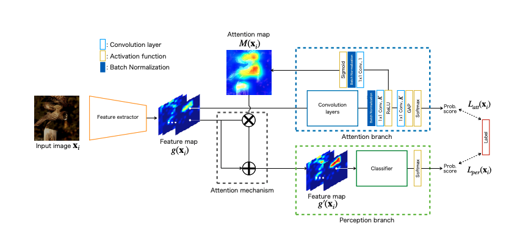

# Attentin Branch Network

The attention map for visual explanation represents a high response value as the attention location in image recognition. This attention region significantly improves the performance of CNN by introducing an attention mechanism that focuses on a specific region in an image. This is an implementation of Neural Network Libraries on [Attention Branch Network](https://arxiv.org/abs/1812.10025).

Figure: Overview of Attention Branch Network.

# Interactive demo

**eXplainable AI**
|Name| Notebook           | Task  | Example                       |
|:---------------------------------:|:-------------:|:-----:|:------------:|
 [Attention Branch Network](https://openaccess.thecvf.com/content_CVPR_2019/html/Fukui_Attention_Branch_Network_Learning_of_Attention_Mechanism_for_Visual_Explanation_CVPR_2019_paper.html) |  | Visualization | |
 
# Citation
This is based on [Attention Branch Network: Learning of Attention Mechanism for Visual Explanation](https://arxiv.org/abs/1812.10025).

