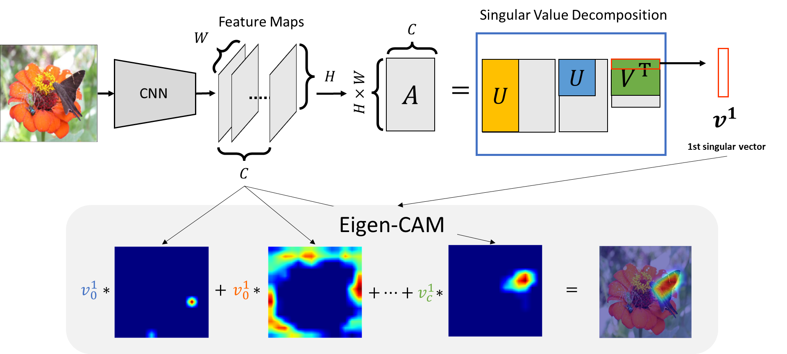

# Eigen-CAM
This is a colab interactive demo of visualizing CNN features using Eigen-CAM.
Eigen-CAM is a technique for making visual explanations for decisions from CNN-based models.
The feature is that the operation is very light with no back propagation, so it can be operated at high speed.
You can take real-time visualiaztion for features of objeect-detection model.

Figure: overview of Eigen-CAM

# Interactive demo

**eXplainable AI**
|Name| Notebook           | Task  | Example                       |
|:---------------------------------:|:-------------:|:-----:|:------------:|
 [Eigen-CAM](https://ieeexplore.ieee.org/document/9206626) |  | visual explanations ||
 
# Citation
Muhammad, M. B. & Yeasin, M. "[Eigen-CAM: Class Activation Map using Principal Components.](https://ieeexplore.ieee.org/document/9206626)" in 2020 International Joint Conference on Neural Networks (IJCNN) 1–7 (IEEE, 2020).