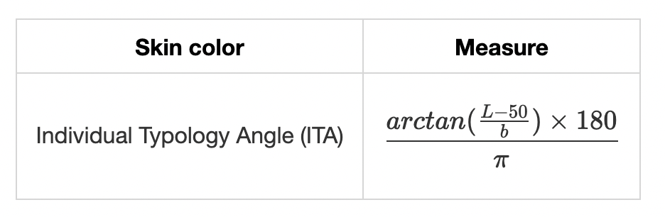
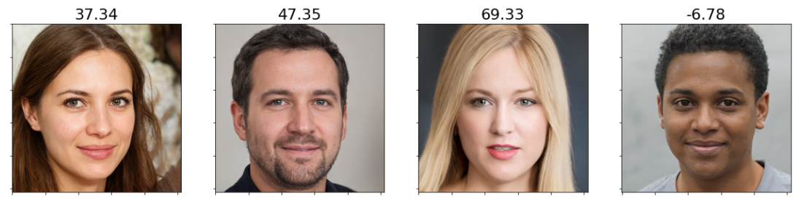
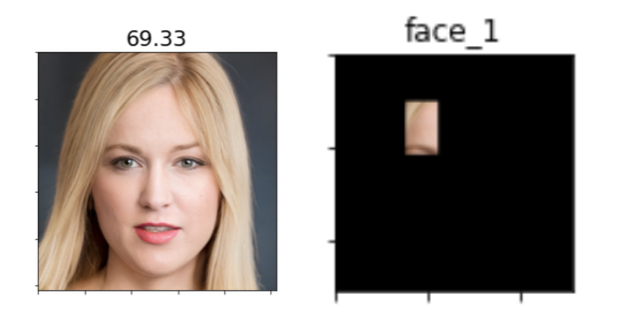
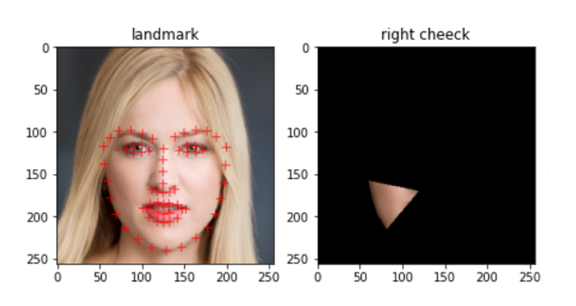

# Facial evaluation for skin color
This is a colab interactive demo of facial evaluation for skin colors by using Individual Typology Angle (ITA), which represents skin color.

The ITA is implemented in CIE-Lab space. The ITA of the skin color measurement is defined by the following equation:

Where the L axis and b quantify luminance and yellowness.

The ITA is calculated by the following steps :
1. Extract masked images in the face. We provide two methods that are to be divided by 9 rectangle region (**Masked Images**) or to be extracted to chin and two cheeks by landmark (**Masked Images Using Landmarks**). 
2. The **Masked Images** version calculates the ITA scores for 9 masked images, then take the mean. The **Masked Images Using Landmarks** version calculates the ITA for 3 masked images (right cheek, chin, and left cheek), then take the mean.

Figure:  Individual Typology Angle (ITA) scores with different faces by the Masked Images version

# Interactive demo
|Name| Notebook           | Task  | Example                       |
|:---------------------------------:|:-------------:|:-----:|:------------:|
Skin Color (Masked Images) |  | Facial evaluation for skin color ||
Skin Color (Masked Images Using Landmarks) |  | Facial evaluation for skin color ||

## Ciatation
Diversity in Faces
Michele Merler, Nalini Ratha, Rogerio S. Feris, John R. Smith, arXiv (2019)
https://arxiv.org/abs/1901.10436