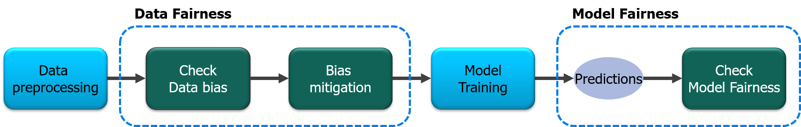
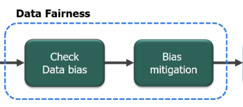

# Introduction of Fairness Workflow Tutorial
## Dataset/Model Bias Check and Mitigation by Reweighing
This is a colab interactive demo of introduction of fairness workflow tutorial. In this tutorial, we have tried to give a gentle introduction to **gender bias detection and mitigation** to enthusiasts of Responsible AI. Although there are many ways to detect and mitigate bias, we have only illustrated one simple way to detect bias and mitigate it with Reweighing algorithm in this tutorial. 

With the proliferation of ML and AI across diverse set of real world problems, there is strong need to keep an eye on explainability and fairness of the impact of ML-AI techniques. This tutorial is one such attempt, offering glimpse into the world of fairness.

We will walk you through an interesting case study in this tutorial. The aim is to familiarize you with one of the primary problem statements in Responsible AI: Bias Detection and Mitigation.

Bias is one of the basic problems which plagues datasets and ML models. After all, ML models are only as good as the data they see.

Before we go into detailed explanation, we would like to give a sneak peak of the steps involved in the bias detection and mitigation process:

  

Figure:  As illustrated in the picture, one must first prepare the data for analysis, detect bias, mitigate bias and observe the effect of bias mitigation objectively with data fairness and model fairness metrics.

# Interactive demo
|Name| Notebook           | Task  | Example                       |
|:---------------------------------:|:-------------:|:-----:|:------------:|
Introduction of Fairness Workflow Tutorial |  | Dataset/Model Bias Check and Mitigation by Reweighing ||

## References
[1] [Ninareh Mehrabi, Fred Morstatter, Nripsuta Saxena, Kristina Lerman, Aram Galstyan. A Survey on Bias and Fairness in Machine Learning. arXiv:1908.09635
](https://arxiv.org/abs/1908.09635)  
[2] Kamiran F, Calders T (2009a) Classifying without discriminating. In: Proceedings of IEEE IC4 international conference on computer, Control & Communication. IEEE press 
[3] [Kamiran, Faisal and Calders, Toon. Data preprocessing techniques for classification without discrimination](https://link.springer.com/content/pdf/10.1007%2Fs10115-011-0463-8.pdf). Knowledge and Information Systems, 33(1):1–33, 2012 
[4] Hardt, M., Price, E., and Srebro, N. (2016). “Equality of opportunity in supervised learning,” in Advances in Neural Information Processing Systems, eds D. D. Lee, M. Sugiyama, U. V. Luxburg, I. Guyon, and R. Garnett (Barcelona: Curran Associates, Inc.), 3315–3323. 
[5] Chouldechova, A. (2017). Fair prediction with disparate impact: a study of bias in recidivism prediction instruments. Big Data 5, 153–163. doi: 10.1089/big.2016.0047 
[6] Zafar, M. B., Valera, I., Gomez Rodriguez, M., and Gummadi, K. P. (2017a). “Fairness beyond disparate treatment & disparate impact: Learning classification without disparate mistreatment,” in Proceedings of the 26th International Conference on World Wide Web (Perth: International World Wide Web Conferences Steering Committee), 1171–1180. doi: 10.1145/3038912.3052660 
[7] https://archive.ics.uci.edu/ml/datasets/Statlog+%28German+Credit+Data%29  
