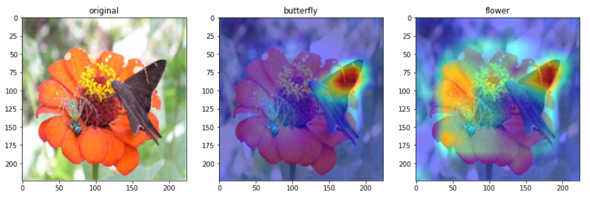

# Grad-CAM
**Grad**ient-weighted **C**lass **A**ctivation **M**apping, **Grad-CAM**, is a technique for making visual explanations for decisions from CNN-based models. Grad-CAM utilizes gradients of any target concept into the final convolution layer, which highlights important region of the decisions. This is an implementation of Neural Network Libraries on [Grad-CAM](https://arxiv.org/abs/1610.02391). 

Figure: Visual explanations on the image samples.

# Interactive demo

**eXplainable AI**
|Name| Notebook           | Task  | Example                       |
|:---------------------------------:|:-------------:|:-----:|:------------:|
 [Grad-CAM](https://arxiv.org/abs/1610.02391) |  | Grad-CAM ||
 
# Citation
This is based on [Grad-CAM: Visual Explanations from Deep Networks via Gradient-based Localization](https://arxiv.org/abs/1610.02391).

