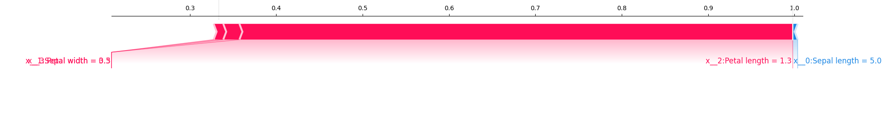

# Kernel SHAP (tabular data)
**SH**apley **A**dditive ex**P**lanation, **SHAP**, is an approach to explain the output of any machine learning model using a game theory. It links optimal credit allocation with local explanations using the classic Shapley values from game theory and their related extensions. This is an implementation of Neural Network Libraries on [SHAP](https://arxiv.org/abs/1705.07874). 


<p align="center">

</p>
<p align="center">
Figure: Visual explanations on the table data samples.
</p>


## Installation of Neural Network Libraries
Please follow the installation guide of the Neural Network Libraries on https://nnabla.org/install/


## How to Run
All processes are executed with the following example command.

```
python kernel_shap.py -i iris_flower_dataset_validation_delo.csv -t iris_flower_dataset_training_delo.csv -os 3 -i2 0 -a 0 -c2 0 -o images/shap.png

```

 | option | input parameters | items |
 |--------|------------------|-------|
 | -i  | {path}   | path to csv file to explain |
 | -t  | {path}   | path to csv file to train |
 | -os  |  {number(int)}  | output size |
 | -i2  |  {number(int)}  | index to explain  |
 | -a  |  {number(int)}  | alpha of Ridge  |
 | -c2  |  {number(int)}  | class index to explain  |
 | -o  | {user setting}   | output folder |

The result is saved with the name of images/shap.png as visualized explanation.
This consists of the processes below. 

### Training
In training phase, the neural network model is trained by the training data.

### SHAP Calculation
In SHAP calculation phase, SHAP values are calculated for the given data to explain.

### Visualize the Results
In visualization phase, results of the retraining are summarized and visualized.
This helps you to understand how each features affect the prediction.

 
## Citation
This is based on [A Unified Approach to Interpreting Model Predictions](https://arxiv.org/abs/1705.07874).
