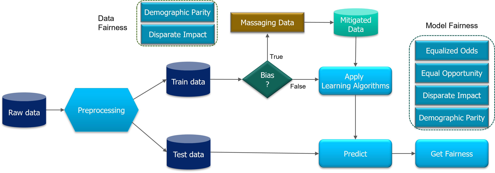

## Dataset/Model Bias Check and Mitigation by Massaging
Welcome to this interactive Colab demo of the Massage Data Preprocessing Algorithm, a fair data preprocessing technique that helps to mitigate discrimination in machine learning models. This algorithm adjusts the labels of sensitive attributes in labeled datasets to achieve fairness, identifying promotion and demotion candidates and selecting the top elements closest to the decision boundary for relabeling to minimize the impact on model accuracy.

In this tutorial, we will provide you with a step-by-step guide on how to apply the Massage Data Algorithm on two popular datasets, the UCI Adult and German dataset, to mitigate bias and achieve fairness in your machine learning models.

Before we go into detailed explanation, we would like to give a sneak peak of the steps involved in the bias detection and mitigation process:

  

Figure:  As illustrated in the picture, one must first prepare the data for analysis, detect bias, mitigate bias and observe the effect of bias mitigation objectively with data fairness and model fairness metrics.

## Interactive demo
|Name| Notebook           | Task  | Example                       |
|:---------------------------------:|:-------------:|:-----:|:------------:|
Massage Data Preprocessing for UCI Adult dataset|  | Massage Data Preprocessing Algorithm on the UCI Adult dataset to check and mitigate dataset/model bias ||

## References
[1] [Kamiran, Faisal, and Toon Calders. "Data preprocessing techniques for classification without discrimination." Knowledge and information systems 33, no. 1 (2012): 1-33
](https://link.springer.com/article/10.1007/s10115-011-0463-8)  
[2] [UCI Adult Dataset](https://archive.ics.uci.edu/ml/datasets/adult)