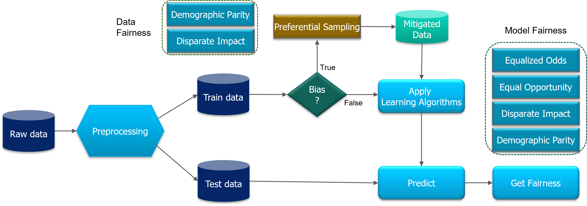

## Dataset/Model Bias Check and Mitigation by Preferential Sampling
Welcome to this interactive Colab demo of the Preferential Sampling Algorithm. This method aims to create a discrimination-free training set where each group is balanced and helps to mitigate the effects of discrimination in the dataset. It also promotes fairness in machine learning models.

In this tutorial, we will provide you with step-by-step guide to apply the Preferential Sampling algorithm on various datasets, and compared on various ML models.

Before we go into detailed explanation, we would like to give a sneak peak of the steps involved in the bias detection and mitigation process:

  

Figure:  As illustrated in the picture, one must first prepare the data for analysis, detect bias, mitigate bias and observe the effect of bias mitigation objectively with data fairness and model fairness metrics.

## Interactive demo
|Name| Notebook           | Task  | Example                       |
|:---------------------------------:|:-------------:|:-----:|:------------:|
Preferential Sampling |  | Preferential Sampling on various dataset to check and mitigate dataset/model bias ||

## References
[1] [Kamiran, Faisal, and Toon Calders. "Classification with no discrimination by preferential sampling." In Proc. 19th Machine Learning Conf. Belgium and The Netherlands, vol. 1, no. 6. Citeseer, 2010]
(https://dtai.cs.kuleuven.be/events/Benelearn2010/submissions/benelearn2010_submission_18.pdf)  
