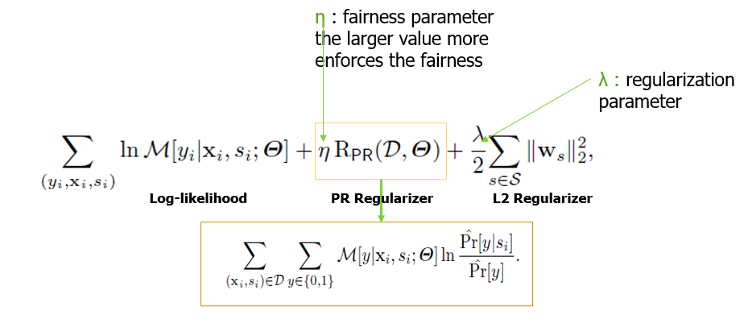

# Prejudice Remover Regularizer Image
This is an interactive demo of `Prejudice Remover Regularizer (PRR)` for visual recognition task on [CelebA](https://mmlab.ie.cuhk.edu.hk/projects/CelebA.html) dataset.
<p align="center">

</p>
<p align="center">
Figure: Overview of Prejudice Remover Regularizer
</p>
In this demo, we show how to reduce **Indirect Prejudice** with **Prejudice Remover Regularizer (PRR)**.
PRR technique involves adding two regularizer terms to cost function: 
- L2 regularizer, $||θ||^2$, to reduce over-fitting
- Prejudice remover regularizer, $R(D,θ)$, to enforce fair classification

<p align="center">

</p>
<p align="center">
Figure: Objective function of Prejudice Remover Regularizer
</p>

To run the 'PRR' experiment in NNabla, please follow the below steps:
### Step 1: Prepare Dataset
* CelebA dataset is considered for this tutorial. 
Please download the dataset and store it in a directory named 'data'.
Authors kindly offer an easy way to prepare the dataset. Follow these instructions in Linux terminal:
```
URL=https://www.dropbox.com/s/d1kjpkqklf0uw77/celeba.zip?dl=0
ZIP_FILE=./data/celeba.zip
mkdir -p ./data/
wget -N $URL -O $ZIP_FILE
unzip $ZIP_FILE -d ./data/
rm $ZIP_FILE
```
* Once dataset is downloaded, you will find a text file named `list_attr_celeba.txt`. 

It must look like this: Attribute names are listed in the first line, followed by image name and binarty attribute table (1 for true, -1 for false)
```
5_o_Clock_Shadow Arched_Eyebrows Attractive Bags_Under_Eyes Bald Bangs Big_Lips Big_Nose ...
000001.jpg -1  1  1 -1 -1 -1 -1 -1 ...
000002.jpg -1 -1 -1  1 -1 -1 -1  1 ...
000003.jpg -1 -1 -1 -1 -1 -1  1 -1 ...
...
```

* Once the dataset is ready, split the dataset into train, validation and test sets with the following command:
```python split_dataset.py --out_dir ./data/train --split train```

### Step 2: Configurations
* `args.py` makes provision for multiple configurations to tinker with the model.
For example, adjust `--attribute` & `--protected_attribute` options to select the target & protected attributes for training the model.
By default, "Attractive" is target attribute & "Male" is protected attribute. All attributes are listed in `celeba_attributes_list.txt`.
Specify the dataset of training directory (with `--celeba_image_train_dir` option), validation directory (with `--celeba_image_valid_dir` option) and the prejudice regularizer (with `--eta` option).

### Step 3: Train Classifier without PRR
* To train base classifier without PRR, prejudice regularizer parameter must be zero (`--eta 0`). Do that with the following command: 
```
python main.py --celeba_image_train_dir [PATH to train dataset] 
--celeba_image_valid_dir [PATH to valid dataset] --attr_path [Path to list_attr_celeba.txt] 
--attribute [target attribute] --protected_attribute [protected attribute] --eta 0 --total_epochs 20
--model-save-path [PATH to save the model parmeters]
```

Please note that the model with best accuracy on the validation set is saved irrespective of total number of epochs. 
 

### Step 4: Train Classifier with PRR
* Train the classifier model with Prejudice Remover Regularizer(tune the prejudice regularizer(`eta`)) with the following command:
```
python main.py --celeba_image_train_dir [PATH to train dataset] 
--celeba_image_valid_dir [PATH to valid dataset] --attr_path [Path to list_attr_celeba.txt] 
--attribute [target attribute] --protected_attribute [protected attribute] --eta 2 --total_epochs 20
--model-save-path [PATH to save the model parmeters]
```

Please note that the model with best accuracy on the validation set is saved irrespective of total number of epochs. 


Experiment results and fairness metrics will be saved under `--model-save-path` directory.

# Citation

**Fairness-aware classifier with prejudice remover regularizer.** Toshihiro Kamishima, Shotaro Akaho, Hideki Asoh & Jun Sakuma. [Joint European Conference on Machine Learning and Knowledge Discovery in Databases ECML PKDD 2012: Machine Learning and Knowledge Discovery in Databases pp 35–50](https://doi.org/10.1007/978-3-642-33486-3_3)

# References
1. "Fairness-aware classifier with prejudice remover regularizer". Toshihiro Kamishima, Shotaro Akaho, Hideki Asoh & Jun Sakuma. Joint European Conference on Machine Learning and Knowledge Discovery in Databases ECML PKDD 2012: Machine Learning and Knowledge Discovery in Databases pp 35–50.
2. "Equality of opportunity in supervised learning". Hardt, Moritz, Eric Price, and Nati Srebro. Advances in neural information processing systems 29 (2016)
3. "Directional bias amplification". Wang, Angelina, and Olga Russakovsky. International Conference on Machine Learning. PMLR, 2021.
4. "The Impossibility Theorem of Machine Fairness--A Causal Perspective". Saravanakumar, Kailash Karthik. arXiv preprint arXiv:2007.06024 (2020).
5. "Adam: A method for stochastic optimization". Kingma, Diederik P., and Jimmy Ba. arXiv preprint arXiv:1412.6980 (2014).
6. "Large-scale celebfaces attributes (celeba) dataset". Liu, Ziwei, Ping Luo, Xiaogang Wang, and Xiaoou Tang. Retrieved August 15, no. 2018 (2018): 11.


