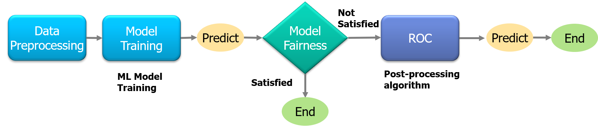

# ROC : Rejection Option-based Classification (Image data) 
This is an interactive demo of `Rejection Option-based Classfication (ROC)` for visual recognition task on [CelebA](https://mmlab.ie.cuhk.edu.hk/projects/CelebA.html) dataset.
<p align="center">

</p>
<p align="center">
Figure: Overview of Rejection Option-based classfication
</p>

In this demo, we show how to reduce bias at prediction time using a post-processing technique with **Rejection Option-based classification (ROC)**.ROC modifies model predictions by assigning favorable outcomes to unprivileged groups and unfavorable outcomes to privileged groups in a confidence band around the decision boundary with the highest uncertainty.
# Interactive demo

|Name| Notebook           | Task  | Example                       |
|:---------------------------------:|:-------------:|:-----:|:------------:|
 [Rejection Option-based Classification for image](https://doi.org/10.1109/ICDM.2012.45) | [](https://colab.research.google.com/github/sony/nnabla-examples/blob/master/interactive-demos/rejection_option_based_classification_images.ipynb) | Mitigate the bias |<a href="url"></a>|
 
To run the 'ROC' experiment in NNabla, please follow the steps below:

### Step 1: Prepare Dataset
* CelebA dataset is considered for this tutorial. 
Please download the dataset and store it in a directory named 'data'.
Authors kindly offer an easy way to prepare the dataset. Follow these instructions in a Linux terminal:
```
URL=https://www.dropbox.com/s/d1kjpkqklf0uw77/celeba.zip?dl=0
ZIP_FILE=./data/celeba.zip
mkdir -p ./data/
wget -N $URL -O $ZIP_FILE
unzip $ZIP_FILE -d ./data/
rm $ZIP_FILE
```
* Once dataset is downloaded, you will find a text file named `list_attr_celeba.txt`. 

It must look like this: Attribute names are listed in the first line, followed by image name and binary attribute table (1 for true, -1 for false)
```
5_o_Clock_Shadow Arched_Eyebrows Attractive Bags_Under_Eyes Bald Bangs Big_Lips Big_Nose ...
000001.jpg -1  1  1 -1 -1 -1 -1 -1 ...
000002.jpg -1 -1 -1  1 -1 -1 -1  1 ...
000003.jpg -1 -1 -1 -1 -1 -1  1 -1 ...
...
```

* Once the dataset is ready, split the dataset into train, validation and test sets with the following command:
```python split_dataset.py --out_dir ./data/train --split train```

### Step 2: Configurations
* `args.py` makes provision for multiple configurations to tinker with the model.
For example, adjust `--attribute` & `--protected_attribute` options to select the target & protected attributes for training the model.
By default, "Blond_Hair" is target attribute & "Male" is protected attribute. All attributes are listed in `celeba_attributes_list.txt`.
Specify the dataset of training directory (with `--celeba_image_train_dir` option) and validation directory (with `--celeba_image_valid_dir` option).

### Step 3: Train Classifier
* Train the classifier model with the following command 

```
python train.py --celeba_image_train_dir [PATH to train dataset] \
--celeba_image_valid_dir [PATH to valid dataset] --attr_path [Path to list_attr_celeba.txt] \
--attribute [target attribute] --protected_attribute [protected attribute] --total_epochs 30 \
--model-save-path [PATH to save the model parmeters]

```


Please note that the model with best accuracy on the validation set is saved irrespective of total number of epochs.

### Step 4: Check Fairness
* Check the Fairness of the trained model with the following command
```
python compute_fairness.py --celeba_image_test_dir [PATH to test dataset] --attr_path [Path to list_attr_celeba.txt] \
--attribute [target attribute] --protected_attribute [protected attribute] --model-save-path [PATH to saved model parameters]
```

If bias occurs (check the fairness metric) in the classifier model, try to use the ROC method to mitigate such bias.


### Step 5: Mitigate bias with ROC
* To run ROC,  we must configure the `optimization_metric` (`DPD` is default optimization_metric),
 upper & lower bounds.
```
python roc.py --celeba_image_valid_dir [PATH to valid dataset] --celeba_image_test_dir [PATH to test dataset] \
--attr_path [Path to list_attr_celeba.txt] --attribute [target attribute] --protected_attribute [protected attribute] \
--optimization_metric [optimization metric(supported metrics DPD/AAOD/EOD)] --metric_upper_bound 0.10 --metric_lower_bound 0.0 \
--model-save-path [PATH to saved model parameters]
```

Compare the experimental results (Step 4 & Step 5) and check how fairness improved after applying the ROC method.

# Citation

**Decision theory for discrimination-aware classification.** Kamiran, Faisal, Asim Karim, and Xiangliang Zhang. In 2012 IEEE 12th International Conference on Data Mining, pp. 924-929. IEEE, 2012

# References
1. "Decision theory for discrimination-aware classification". Kamiran, Faisal, Asim Karim, and Xiangliang Zhang. In 2012 IEEE 12th International Conference on Data Mining, pp. 924-929. IEEE, 2012
2. "Equality of opportunity in supervised learning". Hardt, Moritz, Eric Price, and Nati Srebro. Advances in neural information processing systems 29 (2016)
3. "Adam: A method for stochastic optimization". Kingma, Diederik P., and Jimmy Ba. arXiv preprint arXiv:1412.6980 (2014).
4. "Large-scale celebfaces attributes (celeba) dataset". Liu, Ziwei, Ping Luo, Xiaogang Wang, and Xiaoou Tang. Retrieved August 15, no. 2018 (2018): 11.
5. "AI Fairness 360: An extensible toolkit for detecting and mitigating algorithmic bias".Bellamy RK, Dey K, Hind M, Hoffman SC, Houde S, Kannan K, Lohia P, Martino J, Mehta S, Mojsilović A, Nagar S.
IBM Journal of Research and Development, 63(4/5), pp.4-1.


