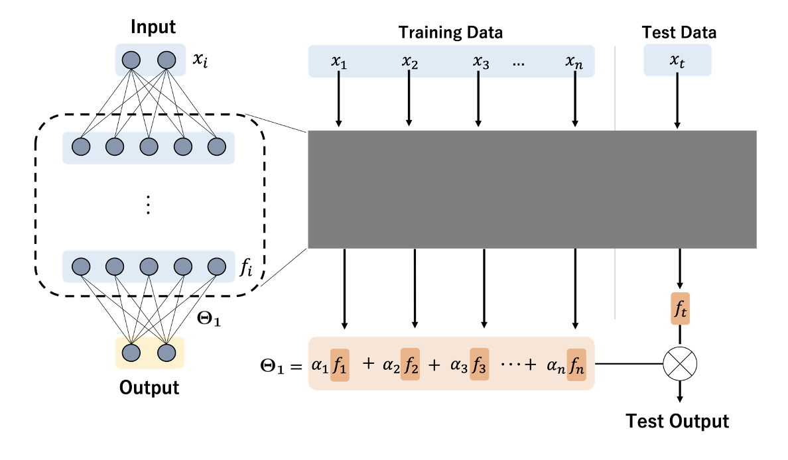
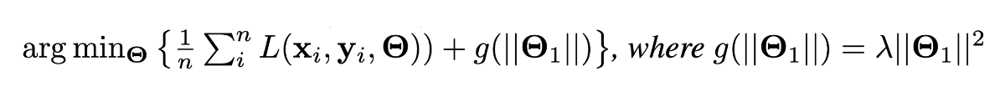
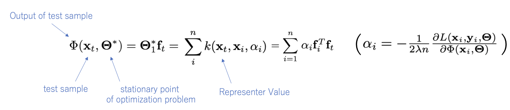
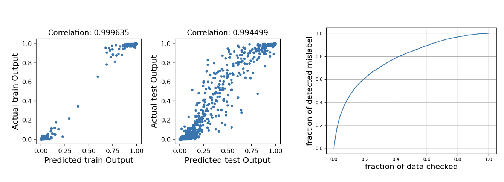

# Representer Point Selection
This is an implementation of Neural Network Libraries for 
*Representer Point Selection for Explaining Deep Neural Netoworks.*  
The goal is explaining the predictions of deep neural networks by decomposing the pre-activation prediction into a linear combination of activations of training points.
<p align="center">
  
</p>

### Theorem
Let us denote the optimization problem as below.
<p align="center">
  
</p>
Then, we have the decomposition of the neural network output as below.
<p align="center">
  
</p>

&alpha;<sub>i</sub> can be used to evaluate the importance of training data x<sub>i</sub> have on stationary point.  
Then, we can detect mislabeled samples by picking the points with bigger |&alpha;<sub>i</sub>|.  

### Result
Two left figures show the correlation between actual and proposed (decomposed) output of network on train and test samples.  
Right figure shows the performance of mislabel detection.  
If we verify the samples in descending order of |&alpha;<sub>i</sub>|, we can 60% of mislabeled samples by checking only 20% of training data.


<p align="center">
  
</p>

# How to Run
## Setup
Install the dependencies as below:
```python
pip install -r requirements.txt
```

## Pre-Training
In order to evaluate the mislabel detection, set `--shuffle_label True`
```python
python train.py \
--shuffle_label False \
--train_epochs 270 \
-c cudnn
```
- dataset file (`.npy` ) will be saved at `./data/input/`
- model parameters will be saved at `./tmp.monitor/`

Then, extract the final affine layer pameters and input / output of them as below.

```python
python generate_feature.py \
--shuffle_label False \
-c cudnn
```

- extracted features (parameters and input / output of final affine layer) will be saved at `./data/info`


## Compute Score
We finetune the affine leyer parameters by back tracking line search with l2 reguralized loss function as below.
```python
python compute_score.py \
--shuffle_label False \
-c cudnn
```

- weight_matrix and score will be saved at `./data/info`

## Analysis
We visualize the performance of mislabel detection for shuffled training dataset as below,
```python
mislabel_detection.py
```

and visualize the correlation between actual and predicted output of network as below.
```python
evaluate_correlation.py
```


## Reference
- Chih-Kuan Yeh, Joon Sik Kim, Ian E.H. Yen, Pradeep Ravikumar.  
[Representer Point Selection for Explaining Deep Neural Networks](https://arxiv.org/abs/1811.09720), arXiv:1811.09720,2018.
