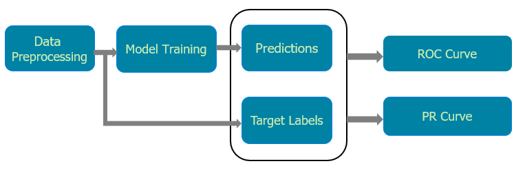

# ## Receiver Operating Characteristic (ROC) Curve and Precision / Recall (PR) curve
This is a colab interactive demo of ROC and PR curve. In this tutorial, ROC curve,PR curve and auc score for structured and unstructured data is explained.

Before we go into detailed explanation, we would like to give a sneak peak of the implementation:

  

Figure:  Flow of ROC and PR curve

# Interactive demo
|Name| Notebook           | Task  | Example                       |
|:---------------------------------:|:-------------:|:-----:|:------------:|
ROC and PR curve Tutorial |  | ROC and PR curve for Structured Data ||
ROC and PR curve Tutorial |  | ROC and PR curve for Unstructured Data ||

# References
1. [Dua, Dheeru. and Graff, Casey. UCI Machine Learning Repository](http://archive.ics.uci.edu/ml). Irvine, CA: University of California, School of Information and Computer Science(2019).
2. Krizhevsky, Alex, and Geoffrey Hinton. "Learning multiple layers of features from tiny images." (2009)
3. He, Kaiming, Xiangyu Zhang, Shaoqing Ren, and Jian Sun. "Deep residual learning for image recognition." In Proceedings of the IEEE conference on computer vision and pattern recognition, pp. 770-778. 2016.
4. He, Kaiming, Xiangyu Zhang, Shaoqing Ren, and Jian Sun. "Identity mappings in deep residual networks." In European conference on computer vision, pp. 630-645. Springer, Cham, 2016.

