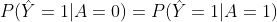
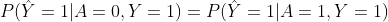
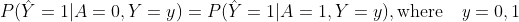

# Three metrics
This is a colab interactive demo of three different fairness metrics in the following:

* Demographic parity
: Prediction of a machine learning model must be independent of protected class A. Demographic parity is defined by the following equation:

* Equal opportunity
: True positive rate outcome must be independent of the protected class A . Equal opportunity  is defined by the following equation:

* Equalised odds
: Positive outcome of the model must be independent of the protected class  A. Equalised odds is defined by the following equation:

Figure: Overview of three metrics.

# Interactive demo

|Name| Notebook           | Task  | Example                       |
|:---------------------------------:|:-------------:|:-----:|:------------:|
 Metrics tutorial |  | Fairness definition||
 
# References
1. Hardt, M., Price, E., and Srebro, N. (2016). “[Equality of opportunity in supervised learning](https://arxiv.org/pdf/1906.09688.pdf)” in Advances in Neural Information Processing Systems, eds D. D. Lee, M. Sugiyama, U. V. Luxburg, I. Guyon, and R. Garnett (Barcelona: Curran Associates, Inc.), 3315–3323.
2. Chouldechova, A. (2017). [Fair prediction with disparate impact: a study of bias in recidivism prediction instruments.](https://arxiv.org/abs/1610.07524)
3. Zafar, M. B., Valera, I., Gomez Rodriguez, M., and Gummadi, K. P. (2017a). [Fairness Beyond Disparate Treatment & Disparate Impact: Learning Classification without Disparate Mistreatment.](https://arxiv.org/abs/1610.08452)
4. [The Impossibility Theorem of Machine Fairness -- A Causal Perspective.](https://arxiv.org/abs/2007.06024)