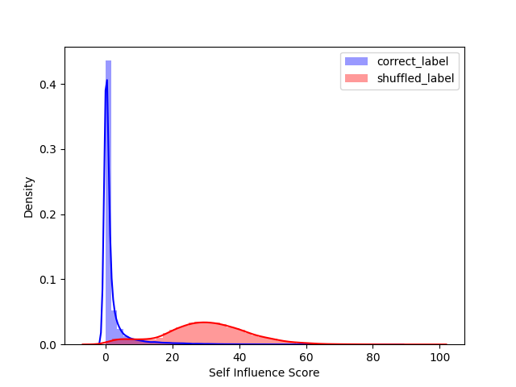

# TracIn
## Overview
NNabla example code of TracIn mislabel detection algorithm.  
you can pick up mislabelled samples only for 20% of training data inspection by proposed method as below.



## Setup
Install the dependencies as below.

```
pip install -r requirements.txt
```


## Training(shuffle label)
If you wanna varificate the efficiency of incorrect labelled sample detection by TracIn algorithm, you must train the network by partially shuffled label(default is `10%`) as below. 
<br>

```
python train.py [-c cudnn] [--shuffle_label True] [--model resnet56] [--output output_path]
```

- shuffled label dataset(`.npy`) will be saved at `output_path`
- model parameters will be saved at log directory(default is `tmp.monitor`)

Example
```
python -u train.py --output output --monitor-path output --model resnet23 --model_save_path output --shuffle_label True -c cudnn
```

## Incorrect Labelled Data Detection

After the incorrect(shuffle) labelled training completes successfully,  calculate self-influence score to find the incorrect labelled sample
<br>

### Calculate Self Influence

Calculate the self-influence as below.
<br>

```
python calculate_score.py [-c cudnn] [--input path to npy files] [--model resnet56] [--checkpoint ckpt_path] [--output output_path]
```

- self influence score will be saved at `output_path`

Example
```
python -u calculate_score.py --output output --checkpoint output --model resnet23 --input output -c cudnn
```


### Mislabel Analyesis

analyse the efficiency of mislabelled detection task by self-influence as below.
<br>

```
python mislabel_analysis.py [--input path to npy files] [--output output_path]
```
<br>

Example
```
python mislabel_analysis.py --input output --output figure
```

## Reference
- Garima Pruthi, Frederick Liu, Mukund Sundararajan, Satyen Kale.[Estimating Training Data Influence by Tracing Gradient Descent](https://arxiv.org/pdf/2002.08484.pdf),arXiv:2002.08484,2020,