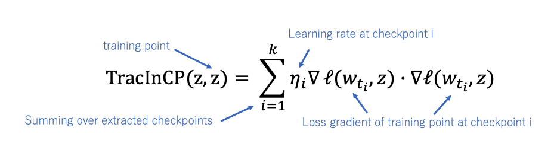

# TracIn

## Overview
This is an implementation of Neural Network Libraries for estimating training data influence by tracing gradient descent called TracIn. The goal is to identify the influence of training data points. TracIn computes the influence of a training sample by tracing the training loss changes as below:

  

This code is an example of mislabeled data detection with TracIn. 


## Setup
Install the dependencies as below:

```
pip install -r requirements.txt
```

## Training(shuffled label)
In order to check the efficiency of mislabelled sample detection by TracIn, please train the network by partially shuffled label (default is `10%`) as below: 
<br>

```python
python train.py [-c cudnn] \
                [--shuffle_label True] \
                [--model resnet56] \
                [--output output_path]
```

- shuffled label dataset(`.npy`) will be saved at `output_path`
- model parameters will be saved at log directory(default is `tmp.monitor`)
<br>

(Example)
```python
python -u train.py --output output \
                   --monitor-path output \
                   --model resnet23 \
                   --model_save_path output \
                   --shuffle_label True \
                   -c cudnn
```
<br>

## Incorrect Labelled Data Detection
After the training is completed, **self-influence** is calculated to find the incorrect labelled sample. The **Self-influence** means the influence of a training point on its own loss.

<br>

### Calculate Self Influence

Calculate the self-influence as below:
<br>

```python
python calculate_score.py [-c cudnn] \
                          [--input path to npy files] \
                          [--model resnet56] \
                          [--checkpoint ckpt_path] \
                          [--output output_path]
```

- self influence score will be saved at `output_path`

(Example)
```python
python -u calculate_score.py --output output \
                             --checkpoint output \
                             --model resnet23 \
                             --input output \
                             -c cudnn
```
<br>

### Mislabel Analyesis

Analyze the efficiency of mislabelled detection task by self-influence as below:
<br>

```python
python mislabel_analysis.py [--input path to npy files] \
                            [--output output_path]
```
(Example)
```pyhton
python mislabel_analysis.py --input output \
                            --output figure
```
<br>

## Reference
- Garima Pruthi, Frederick Liu, Mukund Sundararajan, Satyen Kale.[Estimating Training Data Influence by Tracing Gradient Descent](https://arxiv.org/pdf/2002.08484.pdf),arXiv:2002.08484,2020.
