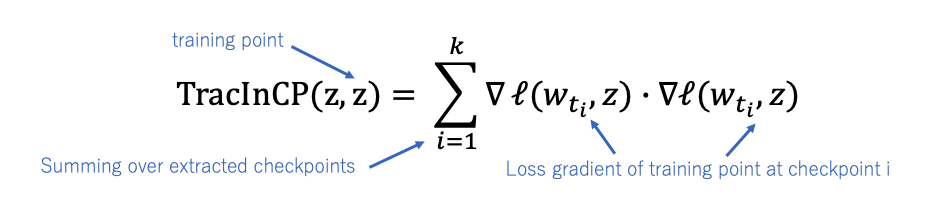
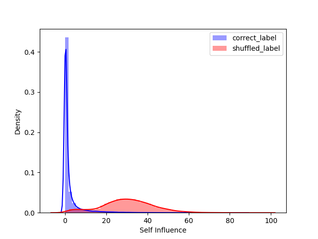
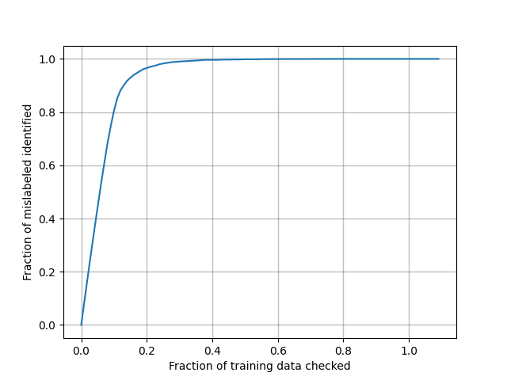

## Overview
NNabla example code of TracIn mislabel detection algorithm.  
TracIn computes the influence of a training sample by tracing the training loss changes as below.
  
TracInCP will increase if sample have a good or bad influence for learning model because of its absolute value of influence.  
However, After the beggining of trainig,  mislabelled (bad influence) sample's would have larger influence than other samples.  
So, you can pick up mislabelled samples only for 20% of training data inspection as below. 



## Setup
Install the dependencies as below.

```
pip install -r requirements.txt
```

## Training(shuffle label)
If you wanna varificate the efficiency of incorrect labelled sample detection by TracIn algorithm, you must train the network by partially shuffled label(default is `10%`) as below. 
<br>

```python
python train.py --output output_path \
                --monitor-path tmp.monitor \
                --model resnet23 \
                --model_save_path tmp.monitor \
                --shuffle_label True \
                -c cudnn
```

- shuffled label dataset(`.npy`) will be saved at `output_path`
- model parameters will be saved at log directory(default is `tmp.monitor`)

<br>

## Incorrect Labelled Data Detection

After the incorrect(shuffle) labelled training completes successfully,  calculate self-influence to find the incorrect labelled sample
<br>

### Calculate Self Influence

Calculate the self-influence as below.
<br>

```python
python calculate_score.py --output output_path \
                        　--checkpoint tmp.monitor \
                        　--model resnet56 \
                        　--input dataset_path \
                        　-c cudnn
```

- self influence score will be saved at `output_path`


<br>

### Mislabel Analyesis

analyse the efficiency of mislabelled detection task by self-influence as below.
<br>


```pyhton
python mislabel_analysis.py --input  dataset_path \
                            --output figure
```
<br>

## Reference
- Garima Pruthi, Frederick Liu, Mukund Sundararajan, Satyen Kale.[Estimating Training Data Influence by Tracing Gradient Descent](https://arxiv.org/pdf/2002.08484.pdf),arXiv:2002.08484,2020,
