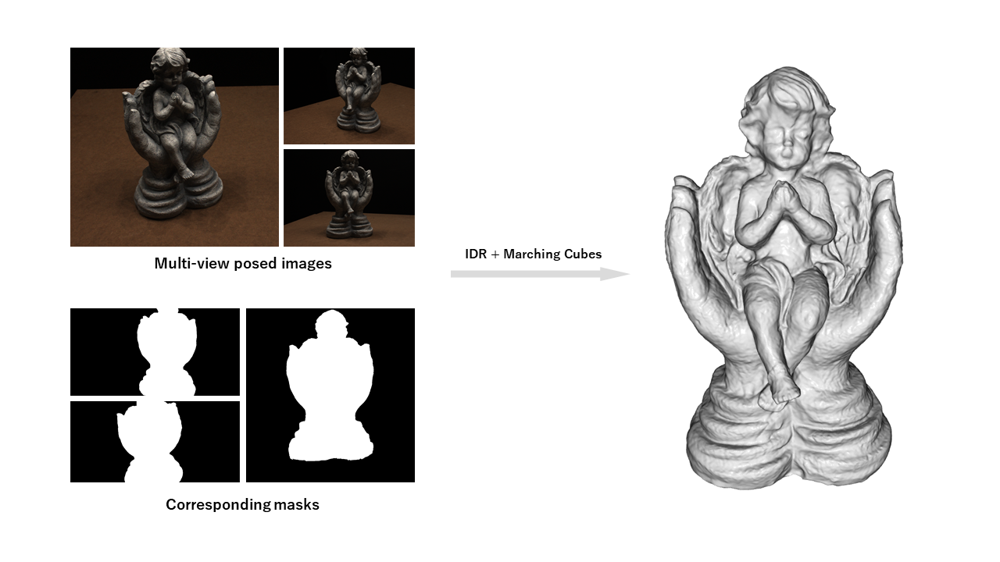
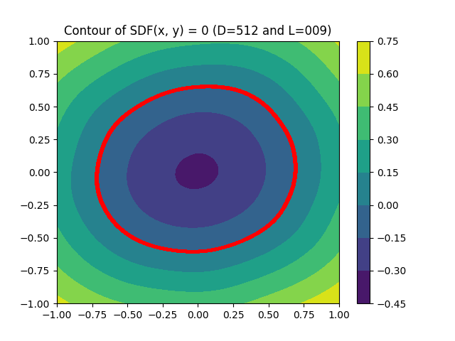

# Implicit Differentiable Renderer 

This is the reproduction work of Implicit Differentiable Renderer (IDR). The goal of IDR is to extract an object surface given multi-view posed images and corresponding masks with no 3D supervision. The method is composed of the follows: 

- Signed distance function as implicit function
- Geometric initialization to initalize the network such that we have sphere-like initial geometry
- Crafted ray tracing; combination of the ray and unit-sphere intersection, sphere tracing, and ray marching
- Losses; RGB, mask, and Eikonal loss.


<p align="center">
  
</p>


# Prerequisite

## Docker

Run the command to build the docker image.

```bash
export NNABLA_VER=1.22.0 \
    && docker build \
        --build-arg http_proxy=${http_proxy} \
        --build-arg NNABLA_VER=${NNABLA_VER} \
        -t nnabla/nnabla-ext-cuda110-nccl2-mpi3.1.6-${NNABLA_VER}dev \
        .
```

## Dependency

To install python dependencies if you do not work with the docker above, install like

```bash
pip install -r requirements.txt
```


# Geometric Initialization

Initial geometry, typically the sphere with _r_ radius at the orign of the world coordinate system, is important to train a network properly. The following two commands are for visually checking if such a initialization works well as expected. Note that we have to use ReLU-like activation function to make geometric initialization work, e.g. SoftPlus.

We can check the contour of the _0.75_-sphere -like SDF, it is the results of the geometric weight initialization.

```bash
python network.py -Ds 512 -R 0.75
``` 


<p align="center">
  
</p>


We can also check the rendered unit sphere -like object, it is the results of the geometric weight initialization.

```bash
python ray_tracer.py -L 9
``` 

In both cases, we see the output png file under the same directory.


# Dataset

Run the following command

```
wget https://www.dropbox.com/s/ujmakiaiekdl6sh/DTU.zip 
unzip DTU.zip
```

If one wants to use the own dataset, please refer to [the IDR author's instruction](https://github.com/lioryariv/idr/blob/main/DATA_CONVENTION.md).


# Train

Copy and paste the confing/default.yaml and change if needed, then

```bash
python train.py --device-id 0 --monitor-path results --config config/default.yaml
```

# Synthesize

Set the config and trained model properly, then

```bash
python synthesize.py --device-id 0 --config results_scan118/default.yaml --model-load-path results_scan118/model_01999.h5
```

Image is rendered in the monitor directory.

# Surface reconstruction

Set the config and trained model properly, then

```bash
python extract.py --device-id 0 --config results_scan118/default.yaml --model-load-path results_scan118/model_01999.h5
```

The ply file are extracted in the monitor directory. Note that to extract the surface as mesh, MarchingCubes algorithm is used. However, the MarchingCubes is used two times; one for obtaining the object orientation and excluding the non-object floating artifacts, the other is for extracting the mesh in a way considering the object orientation.


# Evaluation

Set the config and trained model properly, then

```bash
python evaluate.py --device-id 0 --config results_scan118/default.yaml --model-load-path results_scan118/model_01999.h5
```

In the monitor directory, individual PNSRs and PNSR for all images are reported. Note that PSNR is computed over masked region only according to each object mask.


# Caveat

1. The rendering of the ray tracer is slightly different from the original implementation. In the author's implementation, once we have the negative SDF value in the sphere tracing phase, the simple line-search is performed. However, we store the point of the negative SDF value and the correspondingly previous point of the positive SDF value, which are later used in the ray marching phase for achieving finer-grained intersection.

2. We do not optimize the speed of the ray tracer. More specifically, we can reduce a number of rays to be traced by utilizing the object mask.


# References

1. Lior Yariv et al., "[Multiview Neural Surface Reconstruction by Disentangling Geometry and Appearance](https://arxiv.org/abs/2003.09852)", Neural Information Processing Systems (NeurIPS) 2020.
2. lioryariv/idr, https://github.com/lioryariv/idr.
