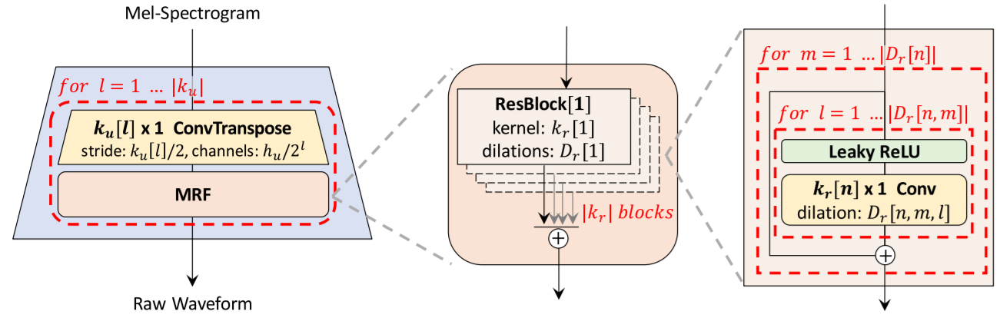

# HiFi-GAN

This is a NNabla implementation of the [HiFi-GAN: Generative Adversarial Networks for Efficient and High Fidelity Speech Synthesis](https://arxiv.org/abs/2010.05646).

HiFi-GAN employs generative adversarial networks (GANs) to produce raw waveforms. It achieves both efficient and high-fidelity speech synthesis.

All hyper-parameters are defined in [hparams.py](hparams.py).

<center>  </center>


## Requirements
### Python environment
Install `python >= 3.6`, then set up python dependencies from [requirements.txt](./requirements.txt):

```bash
pip install -r ./requirements.txt
```
Note that this requirements.txt dose not contain `nnabla-ext-cuda`.
If you have CUDA environment, we highly recommend to install `nnabla-ext-cuda` and use GPU devices.
See [NNabla CUDA extension package installation guide](https://nnabla.readthedocs.io/en/latest/python/pip_installation_cuda.html).

We recommend to use the Dockerfile in the docker directory.
```bash
cd docker
docker build -t you_image_name -f Dockerfile .
```

## Dataset
Download the [LJ dataset](https://keithito.com/LJ-Speech-Dataset/), extract it. Change the `corpus_path` in [hparams.py](hparams.py) accordingly. Run the following command to prepare the dataset.
```bash
python preprocess.py
```
This will take a few minutes. The data will be located into `precomputed_path`. There will be two files: `meta_train.csv` and `meta_test.csv`. These files are used for training and validation, respectively.

## Train
```bash
python main.py --device-id <device id> \
                --context "cudnn"
```
If you have multiple GPUs, then 
```bash
mpirun -n <number of GPUs> python main.py \
    --device-id <list of GPUs>
    --context "cudnn"
```
Expected training time on 4 A6000 GPUs is 5~6 days.

## Inference
Download mel-spectrogram samples from [here](https://nnabla.org/pretrained-models/nnabla-examples/speech-synthesis/HiFiGAN/mel_samples.7z).

Run the following command to synthesize audios from mel spectrograms.

```bash
python synthesize.py --device-id <device id> \
    --context "cudnn" \
    --f-model <model file> \
    --f-mel <mel file> \
    --f-output <output file>
```

The pre-trained model can be downloaded from [here](https://nnabla.org/pretrained-models/nnabla-examples/speech-synthesis/HiFiGAN/model.h5).


Synthesized audio samples can be downloaded from [here](https://nnabla.org/pretrained-models/nnabla-examples/speech-synthesis/HiFiGAN/samples.7z).

# References
1. https://github.com/jik876/hifi-gan
2. Kong, Jungil, Jaehyeon Kim, and Jaekyoung Bae. "HiFi-GAN: Generative Adversarial Networks for Efficient and High Fidelity Speech Synthesis." arXiv preprint arXiv:2010.05646 (2020).