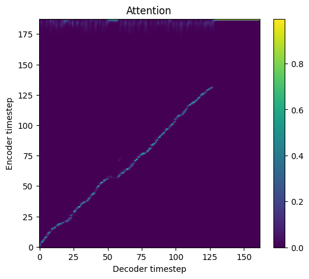
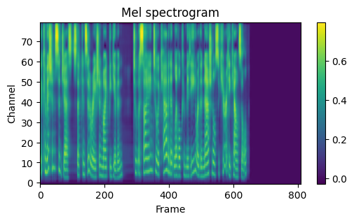

# Tacotron

This is a NNabla implementation of the [Tacotron: Towards End-to-End Speech Synthesis](https://arxiv.org/abs/1703.10135).

Tacotron is an end-to-end text-to-speech synthesis system. It can synthesize speech directly from a sequence of characters. Training data are given as `<text, audio>` pairs. The model takes characters as input and outputs a raw spectrogram. Audios are synthesized from spectrograms using the Griffin-Lim algorithm.

All hyper-parameters are defined in [hparams.py](./hparams.py). We use the values from https://github.com/Kyubyong/tacotron as reference.


The figures below show an alignment, mel spectrogram, and spectrogram as outputs of the model on the [LJ dataset](https://keithito.com/LJ-Speech-Dataset/).

  


## Requirements
### Python environment
Install `python >= 3.6`, then set up python dependencies from [requirements.txt](./requirements.txt):

```bash
pip install -r ./requirements.txt
```
Note that this `requirements.txt` dose not contain `nnabla-ext-cuda`.
If you have CUDA environment, we highly recommend to install `nnabla-ext-cuda` and use GPU devices.
See [NNabla CUDA extension package installation guide](https://nnabla.readthedocs.io/en/latest/python/pip_installation_cuda.html).

## Dataset
Run the following commands to prepare the [LJ dataset](https://keithito.com/LJ-Speech-Dataset/),
```bash
bash scripts/prepare_dataset.sh
```
This will take approximately 1 hour. The data will be located into `./data/LJSpeech-1.1/`. There will be two files: `metadata_train.csv` and `metadata_valid.csv`. These files are used for training and validation, respectively.

## Train
```bash
python main.py --device-id <device id> \
                --context "cudnn"
```
Expected training time on a single GeForce RTX 2080 Ti is 3 days.

If you have multiple GPUs, then 
```bash
mpirun -n <number of GPUs> python main.py \
    --device-id <list of GPUs>
    --context "cudnn"
```
## Inference
```bash
python synthesize.py --device-id <device id> \
    --context "cudnn" \
    --f-model <model file> \
    --f-text <text file> \
    --f-output <output file>
```

The pre-trained model can be downloaded from [here](https://nnabla.org/pretrained-models/nnabla-examples/speech-synthesis/TTS/tacotron/model.h5).

Synthesized audio samples can be downloaded from [here](https://nnabla.org/pretrained-models/nnabla-examples/speech-synthesis/TTS/tacotron/samples.7z).

# References

1. https://google.github.io/tacotron/
2. https://github.com/Kyubyong/tacotron
3. Wang, Y., Skerry-Ryan, R.J., Stanton, D., Wu, Y., Weiss, R.J., Jaitly, N., Yang, Z., Xiao, Y., Chen, Z., Bengio, S. and Le, Q., 2017. [Tacotron: Towards End-to-End Speech Synthesis](https://arxiv.org/abs/1703.10135). INTERSPEECH, 4006-4010