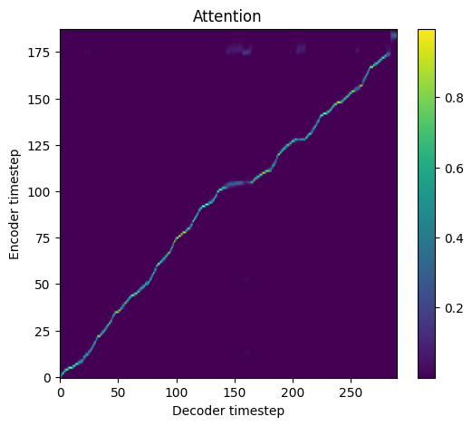
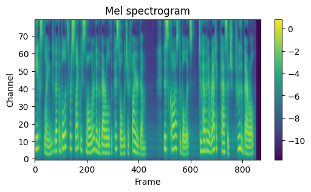

# Tacotron2

This is a NNabla implementation of the [Natural TTS Synthesis By Conditioning Wavenet On Mel Spectrogram Predictions](https://arxiv.org/abs/1712.05884).

Tacotron2 is a neural network architecture for speech synthesis directly from text. It consists of a
recurrent sequence-to-sequence feature prediction network that maps character embeddings to mel-scale spectrograms. Training data are given as `<text, audio>` pairs. The model takes characters as input and outputs a mel spectrogram. Audios are generated from mel spectrograms using a vocoder like WaveNet and WaveGlow.

All hyper-parameters are defined in [hparams.py](./hparams.py). We use the values from https://github.com/NVIDIA/tacotron2 as reference.

The figures below show an alignment and mel spectrogram as outputs of the model on the [LJ dataset](https://keithito.com/LJ-Speech-Dataset/).

 


## Requirements
### Python environment
Install `python >= 3.6`, then set up python dependencies from [requirements.txt](./requirements.txt):
```bash
pip install -r requirements.txt
```
Note that this requirements.txt dose not contain `nnabla-ext-cuda`.
If you have CUDA environment, we highly recommend to install `nnabla-ext-cuda` and use GPU devices.
See [NNabla CUDA extension package installation guide](https://nnabla.readthedocs.io/en/latest/python/pip_installation_cuda.html).

## Dataset
Run the following commands to prepare the [LJ dataset](https://keithito.com/LJ-Speech-Dataset/),
```bash
bash scripts/prepare_dataset.sh
```
The data will be located into `./data/LJSpeech-1.1/`. There will be two files: `metadata_train.csv` and `metadata_valid.csv`. These files are used for training and validation.

## Train
```bash
python main.py --device-id <device id> \
                --context "cudnn"
```
Expected training time on a TITAN RTX 24GB is 5 days.

If you have multiple GPUs, then 
```bash
mpirun -n <number of GPUs> python main.py \
    --device-id <list of GPUs>
    --context "cudnn"
```
Expected training time on 4 GeForce RTX 2080 Ti is 2.9 days.

## Inference
```bash
python synthesize.py --device-id <device id> \
    --context "cudnn" \
    --f-model <model file> \
    --f-text <text file> \
    --f-output <output file>
```
Note that the outputs are mel spectrograms. Use a vocoder such as [WaveGlow](https://github.com/sony/nnabla-examples/tree/master/speech-synthesis/WaveGlow) in order to generate audio waveforms from mel spectrograms.

The pre-trained model can be downloaded from [here](https://nnabla.org/pretrained-models/nnabla-examples/speech-synthesis/TTS/tacotron2/model.h5).

Synthesized audio samples can be downloaded from [here](https://nnabla.org/pretrained-models/nnabla-examples/speech-synthesis/TTS/tacotron2/samples.7z).

# References

1. https://github.com/NVIDIA/tacotron2
2. Shen, J., Pang, R., Weiss, R.J., Schuster, M., Jaitly, N., Yang, Z., Chen, Z., Zhang, Y., Wang, Y., Skerrv-Ryan, R. and Saurous, R.A., 2018. [Natural TTS Synthesis By Conditioning Wavenet On Mel Spectrogram Predictions](https://arxiv.org/abs/1712.05884) In 2018 ICASSP (pp. 4779-4783).