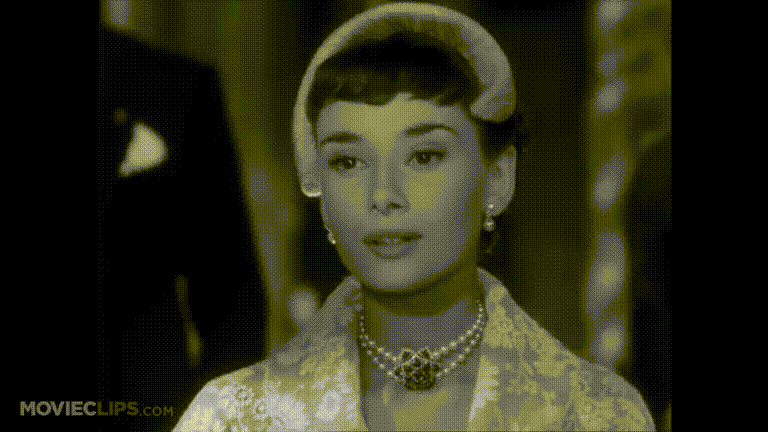
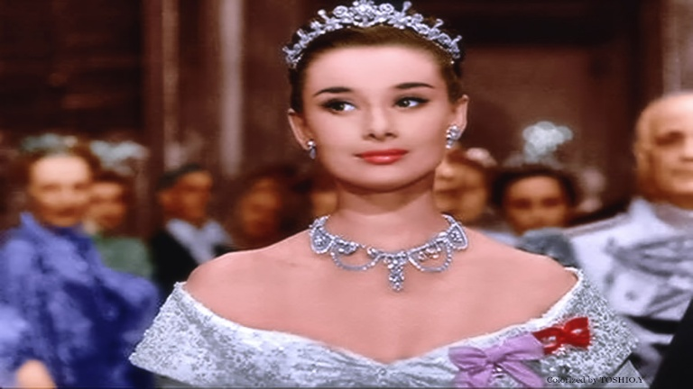
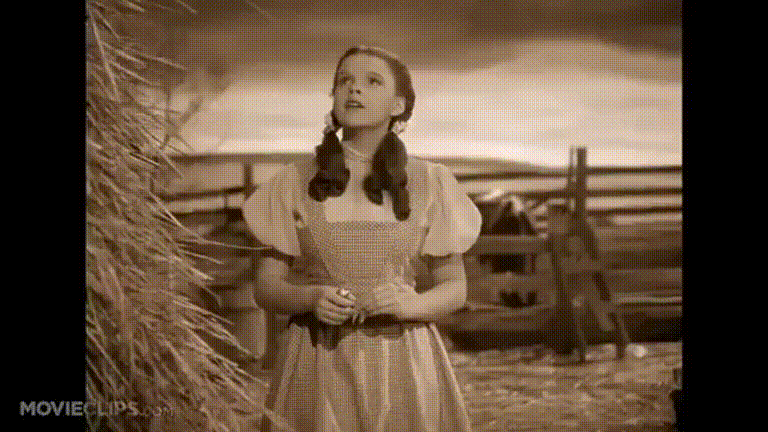
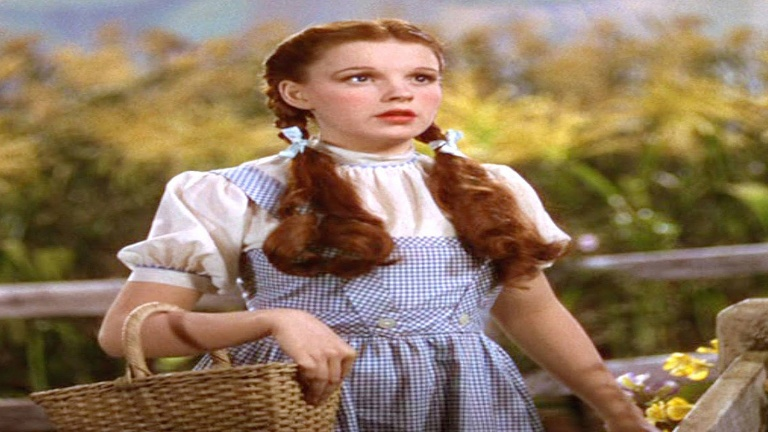
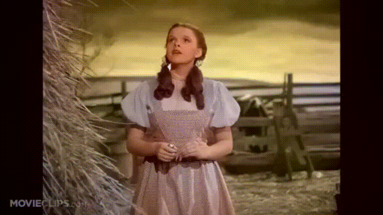

# Deep Exemplar-based Video Colorization 

This repository contains the inference code for "[Deep Exemplar-based Video Colorization ](https://arxiv.org/abs/1906.09909)" 
paper by [Bo Zhang et al.](https://github.com/zhangmozhe/Deep-Exemplar-based-Video-Colorization).

## Introduction
Deep Exemplar-based Video Colorization is claimed to be first end-to-end network for video colorization. It introduces a recurrent framework that unifies the semantic correspondence and color propagation steps to achieve temporal consistency while remaining faithful to reference image.

__Result Examples__

| Input               | Reference                  | Output |
| :--------------------: | :---------------------: | :---------------------: |
| |  |  | 
| |  |  |


## Getting started

## Prerequisites
* nnabla 
* cv2 >=3.3
* pillow
* numpy
* scikit-image

## Inference

### Pre-trained Weights
Pre-trained weights can be downloaded from the following link:  
### Inference using pre-trained weights provided by original authors
Run the below inference command to generate colorized video from given input frames in images/input/v32 directory:

```
python inference.py --input_path images/input/v32 --ref_path images/ref/v32 --output_path images/output/ -c cudnn 
```
Arguments:  
|Arguments  | Description | 
| --- | --- |  
| --input_path |  Path to input frames to be colorized |   
| --ref_path |  Path to reference image(s)  |
|--output_path |  Path to output folder (A folder will be created for every reference image in this location) | 
|--context or -c |  Context (Extension modules : `cpu` or `cudnn`)  |

