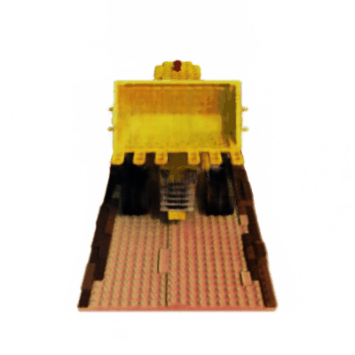
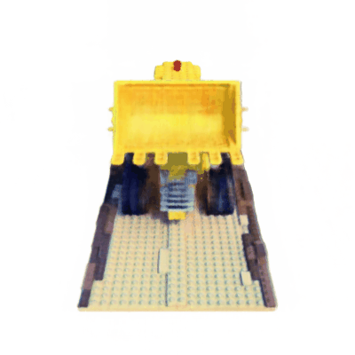

# NeRF Implementation in nnabla

This is the Nnabla implementation of Neural Radiance Fields (NeRF), a model for novel view synthesis based on volumetric rendering. Two variants of NeRF have been implemented:
 - [Original NeRF](https://www.matthewtancik.com/nerf): verified across 20 scenes from LLFF (realistic, forward facing), DeepVoxel and Blender (synthetic) datasets and the test performance has been benchmarked against the original implementation
 - [NeRF in the Wild (NeRF-W)](https://nerf-w.github.io/): verified across synthetic lego scene with artificially added transient occluders and appearance variation and multiple scenes from the phototourism dataset (Sacre Coeur, Brandenburg Gate, Taj Mahal, Hagia Sophia, Notre-Dame)

## Data preparation

### LLFF, DeepVoxel and Blender
The dataset needs to be downloaded from [here](https://drive.google.com/drive/folders/128yBriW1IG_3NJ5Rp7APSTZsJqdJdfc1) and the path to the scene for training the neural network needs to be specified in the corresponding `config/{llff/deepvoxel/blender}.yaml`.

### Phototourism
The dataset can be downloaded from [here](https://www.cs.ubc.ca/~kmyi/imw2020/data.html) and the corresponding tsv file (containing the train/test split) can be downloaded from the "Additional links" in [nerf-w project page](https://nerf-w.github.io/). Note that the repository also contains the script for generating the tsv file that will create a random train/test split. To generate random train/test split, run as follows:

```
python data_iterator/make_tsv.py -d [path to the image folder] -n [dataset name] -s [split percent (% of image to be used for training)] -o [output file path]
```

The `tsv` file should be placed in the downloaded folder of phototourism scene (the same level as the "dense" folder). 

Note that the phototourism data-iterator is based on this [pytorch-lighting nerf-w implementation](https://github.com/kwea123/nerf_pl/tree/nerfw). And as an optional step, you can use this repository to generate cache file for the data-iterator to speedup the data loading process. 


## Instructions

### Training 
After specifying all the parameters and paths in the config file, execute the following to start training:

```
python main.py -c [path to config file] --model [wild/uncertainty/appearance/vanilla] --data-perturb [none/color/occ/both] --save-results-dir [path to store trained paramaters and intermediate model generation]
```

`--model` refers to the variant of NeRF model to be used. There are five possible options: 
- `wild`: refers to NeRF-W. MLP architecture with appearance and transient embedding and uncertainty based loss is used.
- `uncertainty`: refers to NeRF-U. MLP architecture with transient embedding and uncertainty based loss is used.
- `appearance`: refers to NeRF-A. MLP architecture with appearance embedding is used.
- `vanilla`: refers to standard original NeRF

`--data-perturb` refers to the perturbation applied to the dataset. In accordance with the NeRF-W paper, this option has only been tested for the synthetic blender-based lego scene. 
- `none`: refers to no perturbation
- `color`: refers to changing the appearance of lego by changing its color to some random color
- `occ`: refers to placing a transient occluder in the form of a randomly generated color band onto the lego scene that partially blocks the static view (lego itself)
- `both`: refers to applying both `color` and `occ` perturbation

Note that for training NeRF-W on phototourism dataset, an additional argument `--dataset phototourism` should also be passed along with the rest of the arguments. So that can be executed as: 

```
python main.py -c [path to config file] --model [wild/uncertainty/appearance/vanilla] --data-perturb [none/color/occ/both] --save-results-dir [path to store trained paramaters and intermediate model generation] --dataset phototourism
```

### Generating visual results 

For generating the videos displayed on the NeRF project website using NeRF or NeRF-W model, run the following:

```
python visualize.py -c [path to config file] -n [number of images to generate] -w [path to trained weights] -o [filename to store the results in gif format] -d [downsampling factor of the images for faster inference] -v [{'zoom'/'360-rotation'/'default'}]
```

For generating visual results on photo-tourism dataset, you will need to specify the appearance embedding, initial pose and camera trajectory in `phototourism_eval.py`. After doing so, the results can be generated using:

```
python phototourism_eval.py -c configs/taj_mahal.yaml -w [path to pretrained NeRF-W model] --model wild -d [image downscale factor] -n [number of images to generate for the output video] -o [output filename for final output (static appearance+transient embedding) in gif or mp4 format] -os [output filename for static appearance output in gif or mp4 format]
```

Visualization type supports 3 choices (you need to specify one of the three): 
  - `zoom`: Zoom between the near clipping and far clipping plane
  - `360-rotation`: 360 degree rotation along the scene. This does not work with forward facing LLFF data
  - `default`: Each data scene comes with a set of test poses. The default option simly uses those test poses to generate the inference video.

## Performance Comparison

### Quantiative comparison of the original NeRF Model
Performance comparison of the nnabla NeRF model against the original tensorflow NeRF implementation for 20 scenes in LLFF, Deep Voxel and Blender scenes. 

| Dataset. | Scene | PSNR (ours) | PSNR (original paper) |
|:---:|:---:|:---:|:---:|
| LLFF |  T-Rex | 28.40 |  26.80|
|  |  Orchid | 20.90 |  20.36|
|  |  Room | 32.24 |  32.70|
|  |  Fern | 26.86 |  25.17|
|  |  Fortress | 29.76 |  31.16|
|  |  Horns | 28.74 |  27.45|
|  |  Flower | 28.02 |  27.40|
|  |  Leaves | 22.64 |  20.92|
| Deep Voxel |  Armchair |  40.78 |  42.65|
|  |  Cube |  37.10 |  39.19|
|  |  Pedestal |  39.10 |  41.44|
|  |  Vase | 39.36 |  37.32|
| Blender |  Chair |  28.93 |  26.80|
|  |  Drums | 25.02 |  35.01|
|  |  Hotdog |  35.90|  36.18|
|  |  Ficus | 29.60 |  30.13|
|  |  Ship | 30.29 |  28.65|
|  |  Lego |  31.40 |  32.54|
|  |  Material |  29.99 |  29.62|
|  |  Mic |  32.99 |  32.91|

### Qualitative Results

- NeRF Novel view generation
<p float="left">
  
 
</p> 
<p float="left">
  
 
</p> 

- NeRF-W: generating lego with same lighting but different transient occluders
<p float="center">
  
</p> 

- NeRF-W: generating lego with different lighting
<p float="center">
  
</p> 

- NeRF-W: generating Notre-Dame with different daylight
<p float="center">
  
</p> 

- NeRF-W: generating different views of Sacre Coeur 
<p float="center">
  
</p> 

## Notes

- For `llff` dataset, `mogrify` is required for some data processing.
- The original implementation regularizes the color density prediction adding noise to it. But in our implementation, the noise addition of same strength led to `NaN` output. Hence, this regularization was omitted from this implementation.
- NeRF-W architecture is based on [this implementation](https://github.com/kwea123/nerf_pl/tree/nerfw) rather than what is stated in the original paper as we found the results to be better and training to be more stable as compared to the parameters stated in the original paper.
- Additional fine-tuning of NeRF-W architecture on half of a test image in order to find the embeddings for a test image has not been implemented.

## References

- Ben Mildenhall, Pratul P. Srinivasan, Matthew Tancik, Jonathan T. Barron, Ravi Ramamoorthi, Ren Ng, "NeRF: Representing Scenes as Neural Radiance Fields for View Synthesis", ECCV 2020, https://www.matthewtancik.com/nerf
- Tensorflow implementation (from authors): https://github.com/bmild/nerf     
- Pytorch implementation: https://github.com/yenchenlin/nerf-pytorch     
- Another Pytorch implementation https://github.com/krrish94/nerf-pytorch 
- NeRF-W reference https://github.com/kwea123/nerf_pl/tree/nerfw
- colmap related operations https://github.com/colmap/colmap