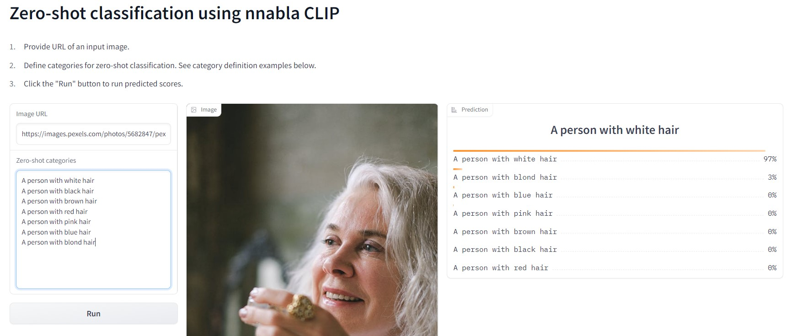

# NNabla-CLIP

This repository contains the nnabla implementation of CLIP(Contrastive Language-Image Pre-Training) released by openAI.  
Click [here](https://arxiv.org/abs/2103.00020) for the original paper "Learning Transferable Visual Models From Natural Language Supervision".

## Approach


## Usage

you can setup the environment via following command:
```bash
$ pip install -r requirements.txt
```

```python
import nnabla as nn
import nnabla.functions as F
from PIL import Image

import clip

with nn.auto_forward():
    clip.load('data/ViT-B-32.h5')

    image = nn.Variable.from_numpy_array(clip.preprocess(Image.open("CLIP.png")))
    image = F.reshape(image, (1, image.shape[0], image.shape[1], image.shape[2]))
    text = nn.Variable.from_numpy_array(clip.tokenize(["a diagram", "a dog", "a cat"]))

    image_features = clip.encode_image(image)
    text_features = clip.encode_text(text)
            
    logits_per_image, logits_per_text = clip.logits(image, text)
    probs = F.softmax(logits_per_image, axis=-1)

    print("Label probs:", probs.d)  # prints: [[0.9927937  0.00421068 0.00299572]]
```

## Download trained models

Trained models are available as:
- [ViT-B/32](https://nnabla.org/pretrained-models/nnabla-examples/vision-and-language/clip/ViT-B-32.h5)(default) to `data/`
- [ViT-B/16](https://nnabla.org/pretrained-models/nnabla-examples/vision-and-language/clip/ViT-B-16.h5) to `data/`
- [ViT-L/14](https://nnabla.org/pretrained-models/nnabla-examples/vision-and-language/clip/ViT-L-14.h5) to `data/`  

These models are converted from the [official models](https://github.com/openai/CLIP) under MIT License.
You can also refer to the [conversion code](notebook-examples/convert_weights.ipynb) in case you'd like to know how PyTorch weights are converted to nnabla.

## API

The CLIP module `clip` provides the following methods:

#### `clip.load(path)`

Loads the model specified by the path to the trained model file.

#### `clip.preprocess(image: PIL Image)`
Returns a numpy.ndarray pre-processed for input to the image encoder.

#### `clip.tokenize(text: Union[str, List[str]], context_length=77)`

Returns a numpy.ndarray containing tokenized sequences of given text input(s). This can be used as the input to the model.

#### `clip.encode_image(image: Variable)`

Given a batch of images, returns the image features encoded by the vision portion of the CLIP model.  
The input shape must be ***(batch_size, c, h, w)***

#### `clip.encode_text(text: Variable)`

Given a batch of text tokens, returns the text features encoded by the language portion of the CLIP model.

#### `clip.logits(image: numpy.ndarray, text: numpy.ndarray)`

Given a batch of images and a batch of text tokens, returns two ndarrays, containing the logit scores corresponding to each image and text input. The values are cosine similarities between the corresponding image and text features, times 100.

## Demo

### Build a Docker image

```bash
# Assume we are at this folder
(cd ../../docker && docker build $(id -un)/nnabla-examples-gradio -f Dockerfile.gradio .)
```

### Zero-shot classification demo



```bash
# From host
docker run --gpus "device=all" --rm -ti -w $(pwd) -v $(pwd):$(pwd):ro --env NO_PROXY="localhost" -p 8889:8889 $(id -un)/nnabla-examples-gradio

# Inside a Docker container
pip install -r requirements.txt
python demo_zero_shot_classification.py
```

### Connect to the demo server using browser

Access `http://<server address>:8889/` on your browser.


## Training 


### Prepare 
- CLIP weight(model)
    - CLIP params (Set to `asset/ViT-B-32.h5`. Converted the official pytorch params to nnabla version) for finetuing
    - CLIP initialized params (Set to `asset/ViT-B-32-initialized.h5`. Converted the clip params initialized with open_clip scripts) for scratch training
- Create an environment of nnabla-ext-cuda-multi-gpu. This code was developed with `nnabla/nnabla-ext-cuda-multi-gpu:py39-cuda110-mpi3.1.6-v1.28.0` on Docker Hub ([Link](https://hub.docker.com/layers/nnabla-ext-cuda-multi-gpu/nnabla/nnabla-ext-cuda-multi-gpu/py39-cuda110-mpi3.1.6-v1.28.0/images/sha256-aa307180e2ea3915a88a7f036b4a6a077c999aaf5a129b9b91a43258884f394d?context=explore))
- Mount the directory containing conceptual captions as `/conceptual_captions/` on the Docker env. If you want to download Conceptual Captions, see [here](https://github.com/mlfoundations/open_clip#conceptual-captions) for an instruction.


### Example
- Fine-tuning with Conceptual Captions 3M:
```
CUDA_DEVICE_ORDER=PCI_BUS_ID CUDA_VISIBLE_DEVICES=0,1 mpirun -n 2 python train.py -ft -b 64 -ag -ep 30 -wi 10000 --train-txt-path /conceptual_captions/cc_3m/Train_GCC-training_output.csv --val-txt-path /conceptual_captions/cc_3m/Validation_GCC-1.1.0-Validation_output.csv --lr 5.0e-4 --beta1 0.9 --beta2 0.98 --eps 1.0e-6 --wd 1.0e-4 --solver AdamW
```

- Scratch training with CC3M:  
(not using `-ft`)  
```
CUDA_DEVICE_ORDER=PCI_BUS_ID CUDA_VISIBLE_DEVICES=0,1 mpirun -n 2 python train.py -b 64 -ag -ep 30 -wi 10000 --train-txt-path /conceptual_captions/Train_GCC-training_output.csv --val-txt-path /conceptual_captions/Validation_GCC-1.1.0-Validation_output.csv --lr 5.0e-4 --beta1 0.9 --beta2 0.98 --eps 1.0e-6 --wd 1.0e-4 --solver AdamW
```

- Scratch training *on 1GPU* with CC3M:  
(not using `-ag`)
```
CUDA_DEVICE_ORDER=PCI_BUS_ID CUDA_VISIBLE_DEVICES=0 python train.py -b 128 -ep 30 -wi 10000 --train-txt-path /conceptual_captions/Train_GCC-training_output.csv --val-txt-path /conceptual_captions/Validation_GCC-1.1.0-Validation_output.csv --lr 5.0e-4 --beta1 0.9 --beta2 0.98 --eps 1.0e-6 --wd 1.0e-4 --solver AdamW
```

Note that the defenition of `weight decay rate` for AdamW is different between nnabla and PyTorch. Set `--wd` on nnabla as `weight_decay * alpha` on PyTorch for the same setting. 

#### Contributor
A part of this work was done during [Soma Kanazawa's](https://github.com/soma-knzw) internship at Sony.