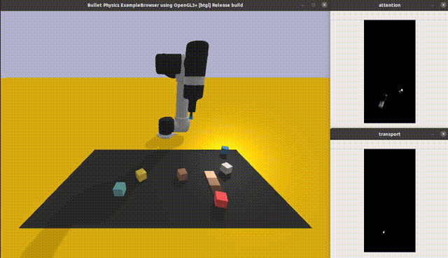

# CLIPort

Reproduction codes of [CLIPORT: What and Where Pathways for Robotic Manipulation](https://arxiv.org/pdf/2109.12098.pdf)
implemented in nnabla.



## Prerequisites

First, clone and install clip and cliport.
See [CLIP's github page](https://github.com/openai/CLIP) and [CLIPort's github page](https://github.com/openai/cliport) for details.


CLIP installation:

```sh
$ pip install git+https://github.com/openai/CLIP.git
```

CLIPort installation:

```sh
$ git clone https://github.com/cliport/cliport.git
$ cd cliport
$ pip install -e .
```

Install also nnabla_cliport.

```sh
$ cd nnabla-examples/vision-and-language/cliport
$ pip install -e .
```

## How to convert "clip" original pytorch params to nnabla params

Download clip params as follows

```sh
$ python download_clip_model.py
```

RN50.h5 file should be created under scripts/ directory.
Then, run clip_param_converter.py

```sh
$ python clip_param_converter.py
```

## How to convert "cliport" original pytorch params to nnabla params

### Download cliport pretrained model

Download cliport_quickstart.zip [following author's instruction here](https://github.com/cliport/cliport).

### Extract the downloaded zip

NOTE: extract the zip file under scripts/

```sh
$ unzip cliport_quickstart.zip
```

Your script directory will contain the below checkpoint files.


```sh
.
~~~~~~
├── cliport_quickstart
│   ├── multi-language-conditioned-cliport-n1000-train
│   │   └── .hydra
│   │   └── checkpoints
│   └── stack-block-pyramid-seq-seen-colors-cliport-n1000-train
│       └── .hydra
│       └── checkpoints
~~~~~~
```

### Transfer pytorch params to nnabla

Generate test data (This is actually not necessary but the directory is referenced internally)

```sh
$ python generate_dataset.py --num-episodes=10 --save-path=./data --mode=test
```

Transfer pytorch model to nnabla.

```sh
$ export CLIPORT_ROOT=$(pwd)
$ python transfer_cliport_model.py eval_task=stack-block-pyramid-seq-seen-colors \
agent=cliport mode=test n_demos=10 train_demos=1000 exp_folder=cliport_quickstart \
checkpoint_type=test_best update_results=True model_task=multi-language-conditioned
```

Convert nnabla params to our redefined nnabla-cliport model params.

```sh
$ python cliport_param_converter.py --model-type=attention
$ python cliport_param_converter.py --model-type=transport
```

## How to run pretrained models on nnabla

### Prerequisite: Generate test data

Generate test data as follows

```sh
$ python generate_dataset.py --num-episodes=10 --save-path=./data --mode=test --task=<task name>
```

```sh
$ python demo.py --task=<task name>
```

## How to train

### Prerequisite: Generate training data

Generate training data as follows.

```sh
$ python generate_dataset.py --num-episodes=1000 --save-path=./data --mode=train --task=<task name>
```

Also install tensorboardx

```sh
$ pip install tensorboardx
```

### Training

You can check available tasks as follows:

```sh
$ python train.py --help
optional arguments:
  -h, --help            show this help message and exit
  --dataset-path DATASET_PATH
  --gpu GPU
  --batch-size BATCH_SIZE
  --task {align-rope,assembling-kits-seq-seen-colorspacking-boxes-pairs-seen-colorspacking-shapes,packing-seen-google-objects-seqpacking-seen-google-objects-group,put-block-in-bowl-seen-colors,stack-block-pyramid-seq-seen-color,separating-piles-seen-colors,towers-of-hanoi-seq-seen-colors} [{align-rope,assembling-kits-seq-seen-colorspacking-boxes-pairs-seen-colorspacking-shapes,packing-seen-google-objects-seqpacking-seen-google-objects-group,put-block-in-bowl-seen-colors,stack-block-pyramid-seq-seen-color,separating-piles-seen-colors,towers-of-hanoi-seq-seen-colors} ...]
  --mode {train,eval,test}
  --iterations ITERATIONS
  --outdir OUTDIR
  --save-interval SAVE_INTERVAL
```


Start the training!
Specify the name of the task which generated the dataset.

```sh
$ python train.py --task <task name>
```

By default, trained parameters will be saved under ./training_results/\<date\>/iteration-\<iteration number\>

### Checking training progress with tensorboard

You can check the training progress with tensorboard.

```sh
$ tensorboard --logdir=./runs
```

## How to evaluate the trained model

Specify the saved snapshot directory to run the evaluation.

```sh
$ python eval.py --snapshot-dir=./training_results/<date>/iteration-<iteration number> --render --show-attention
```